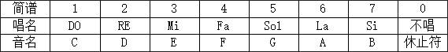

基础积木块编程指南
===================

遥控器
-------

摇杆程序块
"""""""""""

选择摇杆LX、LY、RX、RY，L、R代表左右方向。
BitCon是一款智能编程手柄，基于micro:bit，配置了6个可编程按键、2个全向摇杆、加速度传感器和电子罗盘，
并拥有一个5x5点阵显示屏，可以显示图案、数字和字符等。
BitCon有蓝牙和2.4G两种无线通信方式，可以使用摇杆、
按键和重力感应来控制另外一块micro:bit主板或者Ovobot Bit机器人。

判断按键程序块
"""""""""""""""

BitCon有6个可编程按键，分别为绿色、蓝色、红色、黄色、左上方、右上方按键，
当按键被按下时，可以控制另外一块micro:bit主板或者Ovobot Bit机器人。
也可以连接到电脑，可以使用Ovoblock进行编程来与动画或者游戏角色互动，
还可以与Scratch互动，编写一个Scratch游戏，使用BitCon来闯关。

外观
------

显示字符程序块
"""""""""""""""

.. image:: images/show_string.png
   :width: 169.5

可以控制Bit机器人点阵屏显示相应的字符，选择“等待”即执行完这条指令才会执行下一条指令，
“继续”即执行这条指令同时执行下一条指令。

显示图案程序块
"""""""""""""""

点击显示图案程序块的下拉列表，出现图案绘制面板，绘制相应的图案。绘制图案时，可以一键熄灭或点亮所有LED，点击灰色小方格点亮相应的LED。

熄灭屏幕程序块
"""""""""""""""

.. image:: images/hide_all_matrix.png
   :width: 57

熄灭Bit机器人LED点阵屏。

点亮坐标程序块
"""""""""""""""

.. image:: images/light_axis.png
   :width: 236

点亮Bit机器人LED点阵屏上某个坐标的LED，x、y的数值范围为0~4，零点在点阵屏的左上角，水平向右为x轴，竖直向下为y轴。

设置坐标程序块
"""""""""""""""

分别设置x或y轴的高度。

获得坐标亮度程序块
"""""""""""""""""""

获得x或y轴的坐标亮度。

声音
-----

播放音符程序块
"""""""""""""""

.. image:: images/play_tone.png
   :width: 188

Ovoblock的程序块是使用五线谱的音名来显示的，在C调的乐谱中，它们之间的对应关系如下。

C调中，C、D、E、F、G、A、B分别对应简谱中的1、2、3、4、5、6、7，一个唱名为四分音符持续1个节拍，下方有一个横杠的是八分音符持续1/2节拍，
音符后有一个横杠的为二分音符持续2个节拍。

暂停播放节拍程序块
"""""""""""""""""""

设置暂停播放的节拍数。

无线通讯
---------

控制无线通讯程序块
"""""""""""""""""""

控制打开、接收、复位无线通讯。

发送无线消息程序块
""""""""""""""""""

发送无线消息。

发送无线消息列表程序块
""""""""""""""""""""""

发送无线消息列表。

接收无线消息程序块
""""""""""""""""""

接收无线消息。

接收无线消息列表程序块
""""""""""""""""""""""

   
接收无线消息列表。

设置无线讯息频道程序块
""""""""""""""""""""""

   
设置无线讯息频道。

事件
------

遥控器启动程序块
"""""""""""""""""

   
判断当Bitcon遥控器启动时，执行下一步操作。

判断Bitcon按键按下程序块
""""""""""""""""""""""""

   
BitCon有6个可编程按键，分别为绿色、蓝色、红色、黄色、左上方、右上方按键，当某一按键被按下时，执行下一步操作。

侦测
------

判断姿态程序块
"""""""""""""""

.. image:: images/gesture.png
   :width: 148.5

判断Bit的姿态，执行程序块下方的程序。

加速度程序块
""""""""""""""

返回Bit的x、y和z三个轴的加速度值。

指南针角度程序块
""""""""""""""""

返回Bit机器人头部朝向与地球北极方向的夹角，数值范围为顺时针0~359度。

指南针磁场强度程序块
""""""""""""""""""""

.. image:: images/compass_magnetic_density.png
   :width: 96.5

反馈当前环境中总磁场强度，单位是纳特斯拉。用磁铁靠近电子罗盘，看看磁场强度有什么变化。

校正指南针程序块
"""""""""""""""""

校正指南针。

温度程序块
"""""""""""

反馈温度传感器检测到的温度值。

亮度级别程序块
""""""""""""""

.. image:: images/light_level.png
   :width: 62.5

反馈光敏传感器感应环境光线的强度。可以尝试修改亮度级别，看看不同级别对应什么样的亮度。

运行时间程序块
""""""""""""""

.. image:: images/running_time.png
   :width: 88

反馈Bit机器人的运行时间。

