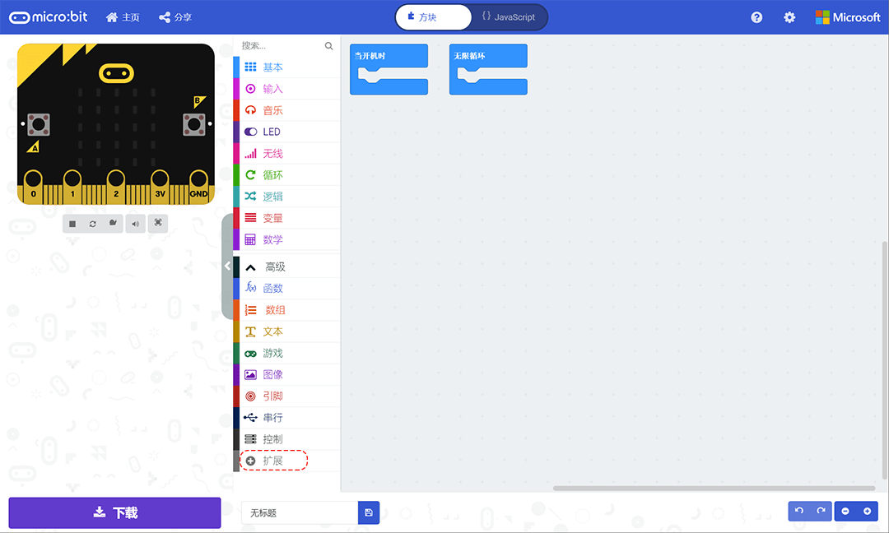
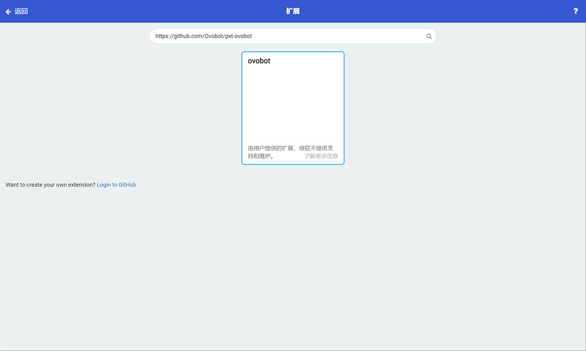
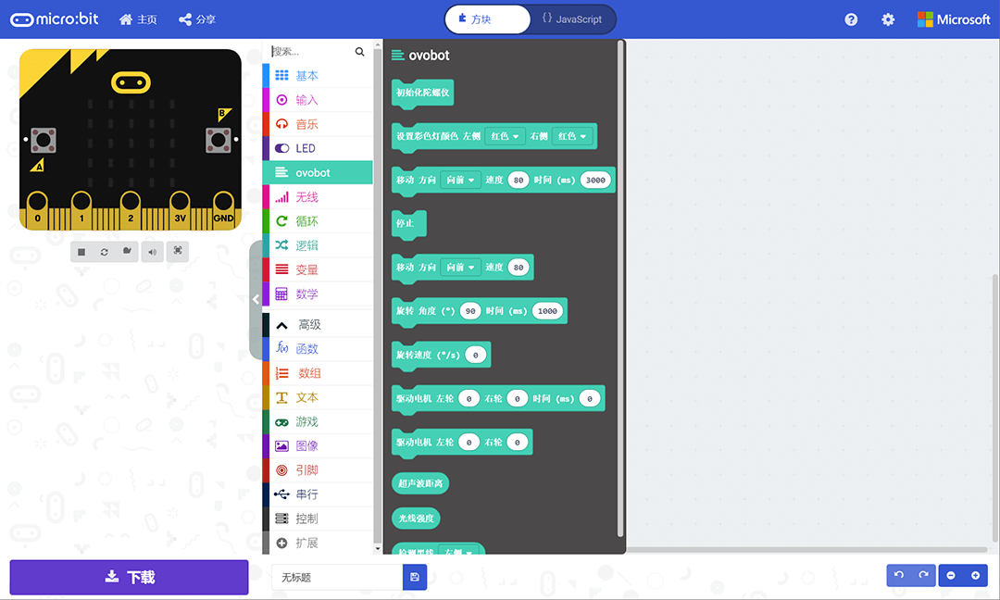

Ovobot Bit MakeCode指南
========================

Ovobot Bit机器人基于micro:bit，所以你也可以选择MakeCode micro:bit来给Bit机器人编程。

首先打开 `MakeCode编辑器 <https://makecode.microbit.org/#editor>`_，然后点击高级中的扩展按键。

在弹出的扩展界面的搜索框中输入https://github.com/Ovobot/pxt-ovobot，并点击搜索。

选择搜索到的ovobot扩展包添加的编辑器中。

