基础积木块编程指南
========================

运动
-----

 1. 设置移动速度程序块

        .. image:: images/move.png
            :width: 154

    设置Bit机器人的前进或后退的速度，数值范围为0~255。

    例子：

    当绿旗被点击时，Bit机器人以100的速度匀速前进，等待1秒后停止运动。

    .. image:: images/move_example.png
        :width: 154

    .. image:: images/null.png

 2. 设置移动速度及时间程序块

        .. image:: images/move_duration.png
            :width: 260.5

    通过设定Bit机器人的运动方向、运动速度和持续时间来让机器人运动，速度范围为0~255。

    例子：

    当绿旗被点击时，Bit机器人以100的速度匀速前进，持续时间为1秒。

    .. image:: images/move_duration_example.png
        :width: 260.5

    .. image:: images/null.png

 3. 设置旋转速度程序块

        .. image:: images/rotate_turn.png
            :width: 154

    控制Bit机器人原地旋转，设置向左或者向右的旋转速度，速度范围为0~255。

    例子：

    当绿旗被点击时，Bit机器人以100的速度向左旋转，等待1秒后停止运动。

    .. image:: images/rotate_turn_example.png
        :width: 154

    .. image:: images/null.png

 4. 设置旋转速度及时间程序块

        .. image:: images/rotate_turn_duration.png
            :width: 260.5

    控制Bit机器人原地旋转，设置向左或者向右的旋转速度以及持续时间，速度范围为0~255。

    例子：

    当绿旗被点击时，Bit机器人以100的速度向左旋转，持续时间为1秒。

    .. image:: images/rotate_turn_duration_example.png
        :width: 260.5

    .. image:: images/null.png

 5. 停止运动程序块

       .. image:: images/stop_move.png
            :width: 57
    
    设置Bit机器人左右两个电机的运动速度为0。

    例子：

    当绿旗被点击时，Bit机器人以100的速度向左旋转，等待1秒后停止运动。

    .. image:: images/rotate_turn_example.png
        :width: 154

    .. image:: images/null.png       

 6. 驱动电机程序块

        .. image:: images/rawMotor_left_right.png
            :width: 190

        .. image:: images/rotate_example.png
            :width: 410

    分别驱动Bit机器人的左右两个轮子的转速，通过设置左右轮子的不同转速，使机器人以设置的角度边旋转边前进。

    如通过电脑键盘的方向键控制Bit前进、后退、左转和右转，空格键控制Bit停止。

    例子：

    当绿旗被点击时，Bit机器人的驱动电机以左轮-255、右轮100的速度行走，等待1秒后，再以左轮100右轮-255的速度前进后停止运动。（即先左拐再右拐）

    .. image:: images/rawMotor_left_right_example.png
        :width: 193.5

外观
-----

 1. RGB LED灯颜色设置程序块

        .. image:: images/set_led_color.png
            :width: 259

    可以分别设置左右两侧LED灯的颜色。
   
    * 下图主板上的标记位置为RGB LED灯，即Bit的发光模块，分别为左侧LED和右侧LED。
    * RGB LED灯是一种以三原色共同交集成像的发光装置，通过设置不同的R（红色）、G（绿色）、B（蓝色）亮度来达到显示不同颜色的效果。
    * LED灯有工作电压低、工作电流小、可靠性高和寿命长等特点，被广泛应用于汽车和城市照明等。

        .. image:: images/RGB_LED.png
            :width: 200

    例子：

    当绿旗被点击时，Bit机器人的彩色灯左侧为橙色，右侧为蓝色，等待1秒后，彩色灯左侧变为绿色，右侧变为紫色，再等待1秒后变回原来的颜色，如此重复执行这一指令。
  
    .. image:: images/set_led_color_example.png
        :width: 270

    .. image:: images/null.png       

 2. 显示字符程序块

        .. image:: images/show_string.png
            :width: 169.5

    可以控制Bit机器人点阵屏显示相应的字符，选择“等待”即执行完这条指令才会执行下一条指令，“继续”即执行这条指令同时执行下一条指令。

    * 下图中标记位置为Bit机器人的LED点阵屏幕，可以用来显示图案、数字、动画或者一段英文字符。

    * LED点阵屏由LED(发光二极管）组成，以灯珠亮灭来显示信息，是各部分组件都模块化的显示器件，通常由显示模块、控制系统及电源系统组成。

    .. image:: images/Lattice_screen.png
        :width: 200

    .. image:: images/null.png

 3. 显示图案程序块

        .. image:: images/show_image.png
            :width: 109

    点击显示图案程序块的下拉列表，出现图案绘制面板，绘制相应的图案。绘制图案时，可以一键熄灭或点亮所有LED，点击灰色小方格点亮相应的LED。

    .. image:: images/LED.png
        :width: 150

    例子：

    当绿旗被点击时，Bit机器人的LED灯显示“❤”的图案，等待0.5秒后，变为显示“2”的图案，同样显示0.5秒。

    .. image:: images/show_image_example.png
        :width: 109

    .. image:: images/null.png

 4. 熄灭屏幕程序块

        .. image:: images/hide_all_matrix.png
            :width: 57

    熄灭Bit机器人LED点阵屏。

    例子：

    当绿旗被点击时，Bit机器人的LED灯显示“❤”的图案，等待2秒后，熄灭屏幕。

    .. image:: images/hide_all_matrix_example.png
        :width: 109

 5. 点亮坐标程序块

        .. image:: images/light_axis.png
            :width: 236

    点亮Bit机器人LED点阵屏上某个坐标的LED，x、y的数值范围为0~4，零点在点阵屏的左上角，水平向右为x轴，竖直向下为y轴。

        .. image:: images/light_axis_example2.png
            :width: 200

    例子：

    当绿旗被点击时，点亮Bit机器人LED点阵屏上坐标为x：2、y：2的LED，等待1秒后，熄灭LED，再等待1秒后点亮此坐标，如此重复执行这一指令。

    .. image:: images/light_axis_example.png
        :width: 247

 6. 设置坐标程序块

        .. image:: images/show_on_the_axis.png
            :width: 216.5

    分别设置x或y轴的高度。

声音
-----

 1. 播放音符程序块

        .. image:: images/play_tone.png
            :width: 188

    * 下图主板上的标记位置为蜂鸣器，即Bit的发声模块。
    * 蜂鸣器是一种一体化结构的电子讯响器，采用直流电压供电，广泛应用于计算机、打印机、复印机、报警器、电子玩具、汽车电子设备、电话机和定时器等电子产品中作发声器件。

        .. image:: images/buzzer.png
            :width: 200

    简谱和音名的对应关系：我们在生活中，一般接触到的都是1234567这样的简谱，但Ovoblock的程序块是使用五线谱的音名来显示的，在C调的乐谱中，它们之间的对应关系如下。

    .. image:: images/music.png

    C调中，C、D、E、F、G、A、B分别对应简谱中的1、2、3、4、5、6、7，一个唱名为四分音符持续1个节拍，下方有一个横杠的是八分音符持续1/2节拍，音符后有一个横杠的为二分音符持续2个节拍，同学们按照音符和节拍数编写整段音乐。

    比如下面的上学歌，不划线是四分音符，在这首曲子中是一个节拍，一道下划线的节拍相当于八分音，在这首曲子中是1/2拍。
    
    一些音符后面会加-，表示音符持续，例如7 - 代表 7 这个音占了两个节拍，7- - 则表示3个节拍。

    .. image:: images/song.png

    例子：

    当绿旗被点击时，播放C音符持续一个节拍，然后播放E音符持续一个节拍。

    .. image:: images/play_tone_example.png
        :width: 188

 2. 暂停播放节拍程序块

        .. image:: images/rest.png
            :width: 152

    设置暂停播放的节拍数。

引脚
-----

1. 引脚被接触程序块

        .. image:: images/pin.png
            :width: 143

    判断引脚是否被接触。

 2. 读取引脚模拟值程序块

        .. image:: images/pin_analog_quantity.png
            :width: 154.5

    读取设置引脚的模拟值。

 3. 设置引脚模拟值程序块

        .. image:: images/set_analog_quantity.png
            :width: 193.5

    设置选定引脚的模拟值。

 4. 读取引脚数字值程序块

        .. image:: images/pin_with_numbber_input.png
            :width: 154.5

    读取设置引脚的数字值。

 5. 设置引脚数字值程序块

        .. image:: images/set_digital_output.png
            :width: 201

    设置选定引脚的数字值。

无线通讯
--------

 1. 控制无线通讯程序块

        .. image:: images/wireless_communication.png
            :width: 79.5

    控制打开、接收、复位无线通讯。

 2. 发送无线消息程序块

        .. image:: images/send_wireless_message.png
            :width: 126

    发送无线消息。

 3. 发送无线消息列表程序块

        .. image:: images/send_containing_bytes.png
            :width: 264.5

    发送无线消息列表。

 4. 接收无线消息程序块

        .. image:: images/receive_wireless_message.png
            :width: 86

    接收无线消息。

 5. 接收无线消息列表程序块

        .. image:: images/receive_wireless_containing.png
            :width: 108
   
    接收无线消息列表。

 6. 设置无线讯息频道程序块

        .. image:: images/set_wireless_channel.png
            :width: 146.5
   
    设置无线讯息频道。

事件
-----

 1. 程序的起点

        .. image:: images/click.png
            :width: 85

    当机器人处于实时模式时，点击绿旗，执行此模块下方的程序。

        .. image:: images/bit.png
            :width: 101.5

    当机器人处于离线模式时，启动Ovobot Bit，执行此模块下方的程序。

    例子：

    当绿旗被点击时，播放C音符持续一个节拍。

    .. image:: images/click_example.png
        :width: 188

 2. 键盘按键按下事件程序块

        .. image:: images/key_pressde.png
            :width: 120

    键盘按键共包含42种可编程按键，由方向键、数字键、字母键组成，当对应的按键被按下时，执行此模块下方的程序。

    例子：

    当按下键盘的空格键时，Bit机器人的左、右轮同时以100的速度前进。

    .. image:: images/key_pressde_example.png
        :width: 190

 3. 当按钮按下事件程序块

        .. image:: images/button_pressed.png
            :width: 127.5

    按钮指的是micro:bit的两个可编程按键，分为A和B，当对应Bit的按钮被按下时，执行此模块下方的程序。

    例子：

    广播程序块是不同角色之间通信的桥梁，一个角色可以广播一个消息，另外一个角色可以侦听这个消息。
    
    当按下micro:bit的A键时，一个角色广播消息“开心”，另一个角色接收到“开心”的消息时，LED点阵屏显示图案“❤”。

    .. image:: images/button_pressed_example.png
        :width: 127.5

    
 4. 当红外遥控器按键按下程序块

        .. image:: images/IR_controller.png
            :width: 185.5

    Ovobot Bit有红外接收模块，可用于红外遥控器控制机器人的运动、图案、声音等。
    
    按键共包含42种可编程按键，由方向键、数字键、字母键组成，当红外遥控器对应的按钮被按下时，执行此模块下方的程序。

    红外遥控器是一种利用红外发光二极管，以红外光为载体将按键端信息传递给接收端的设备。

    红外遥控器：

        .. image:: images/IR.png
            :width: 294

    用离线模式，把程序下载到Bit里，通过遥控器的4个方向键，来控制Bit前进，后退，左转，右转。程序下载到Bit机器人开始执行，根据按下不同的按键执行相应的运动程序。
    
    Bit程序：

    .. image:: images/Bit_order.png
        :width: 500

    例子：

    当按下红外遥控器的M键时，Bit机器人以255的速度后退2秒。

    .. image:: images/IR_controller_example.png
        :width: 260

 5. 当响度大于程序块

        .. image:: images/loudness.png
            :width: 89

    响度返回的值是声音传感器返回的值，数值范围为0～255，当响度大于设置数值时，执行此模块下方的程序。

 6. 当接收到消息程序块

        .. image:: images/receive.png
            :width: 120.5

    当接收到设定消息时，执行此模块下方的程序。

    例子：

    当接收到消息1时，LED点阵屏显示图案“❤”。

    .. image:: images/receive_example.png
        :width: 120.5

 7. 广播程序块

广播程序块是不同角色之间通信的桥梁，一个角色可以广播一个消息，另外一个角色可以侦听这个消息，当接收到消息时执行相应的程序。

例子：

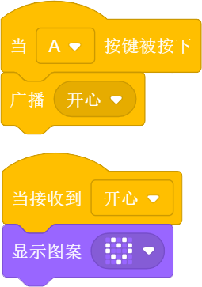

当按下micro:bit的A键时，一个角色广播消息“开心”，另一个角色接收到“开心”的消息时，LED点阵屏显示图案“❤”。

广播并等待程序块
"""""""""""""""""

.. image:: images/broadcast_wait.png
   :width: 137.5

一个角色可以广播一个消息并等待。

控制
-----

等待N秒程序块
""""""""""""""

.. image:: images/wait_seconds.png
   :width: 85

等待N秒后执行其下方的程序，N为圆角矩形框内的数值。

例子：

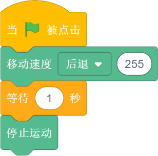

当绿旗被点击时，Bit机器人以255的速度后退，等待一秒后停止运动。

重复执行N次程序块
""""""""""""""""""

.. image:: images/repeat.png
   :width: 113

重复执行其内部程序N次，N为圆角矩形框中的数值。

例子：

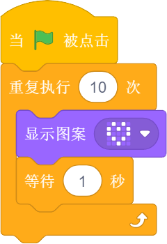

当绿旗被点击时，显示图案“❤”，等待1秒后再次显示，如此重复执行此指令10次。

重复执行程序块
"""""""""""""""

.. image:: images/forever.png
   :width: 113

重复执行程序块内部包含的程序。

例子：

.. image:: images/forever_example.png
   :width: 120

当绿旗被点击时，显示图案“❤”，等待2秒后显示图案“◇”，等待2秒后再次显示图案“❤”，如此重复执行此指令。

如果……那么……程序块
""""""""""""""""""

.. image:: images/if_then.png
   :width: 113

当六边形框内的条件满足时执行程序块内部的程序。

例子：

.. image:: images/if_then_example.png
   :width: 221.5

当绿旗被点击时，如果引脚1被触摸，显示图案“❤”，如此重复执行此指令。

如果……那么……否则程序块
"""""""""""""""""""""""

.. image:: images/if_then_else.png
   :width: 113

当六边形框内的条件满足时执行那么内部的程序，不满足时执行否则内部的程序。

例子：

.. image:: images/if_then_else_example.png
   :width: 349.5

当绿旗被点击时，如果超声波传感器1检测到障碍物的距离小于15，
那么彩色灯显示左侧为橙色，右侧为黄色，否则彩色灯显示左侧为紫色，右侧为蓝色，如此重复执行此指令。

等待直到程序块
"""""""""""""""

.. image:: images/wait_until.png
   :width: 74

等待直到条件为真时才继续执行接下来的程序块。

重复直到程序块
"""""""""""""""

.. image:: images/repeat_until.png
   :width: 118.5

重复执行其内部的程序，直到六边形框内的条件满足，才执行程序块下方的程序。

例子：

.. image:: images/repeat_until_example.png
   :width: 296

当绿旗被点击时，若x轴加速度大于200，Bit机器人停止运动。

侦测
-----

判断按钮按下事件程序块
"""""""""""""""""""""""

选择机器人按键触发事件的回调函数。

红外遥控器按键判断程序块
""""""""""""""""""""""""

.. image:: images/IR_Remote_Controller.png
   :width: 202.5

如果M按键按下的话，返回值就是True, 否则返回值是false。

例子：

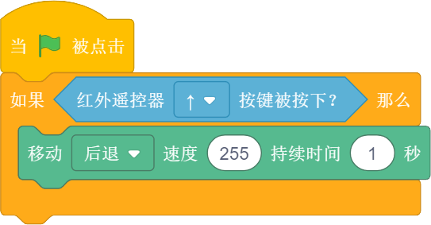

当绿旗被点击时，如果红外遥控器的“↑”键被按下，那么Bit机器人以255的速度后退，持续时间为1秒。

判断Bit姿态程序块
""""""""""""""""""

判断机器人的姿态，执行程序块下方的程序。

加速度程序块
""""""""""""""

.. image:: images/acceleration.png
   :width: 129.5

返回Bit的x、y和z三个轴的加速度值。

例子：

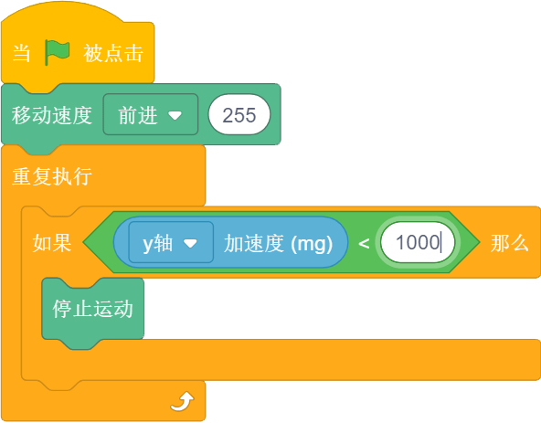

当绿旗被点击时，Bit机器人以255的速度前进，若y轴的加速度小于1000，则停止运动。

响度程序块
"""""""""""

我们用响度来表示声音传感器的反馈值，响度的范围大小是0-255。

例子：

.. image:: images/loudness_Modular_example.png
   :width: 283

当绿旗被点击时，如果声音传感器检测到响度大于100，那么Bit机器人以100的速度持续前进1秒，然后停止运动。

电池电量程序块
"""""""""""""""

.. image:: images/battery_level.png
   :width: 83

电池电量模块可以实时显示Bit的百分比电量。

陀螺仪程序块
""""""""""""

陀螺仪程序块用来反馈Bit的俯仰、横滚和侧偏的角速度。
下图主板上的标记位置为Bit机器人的陀螺仪传感器，陀螺仪传感器可用于检测Bit的旋转角速度，并可以计算旋转的角度。

.. image:: images/gyro1.png
   :width: 250

下图所示分别为Bit的俯仰、横滚和偏航对应的轴和方向。

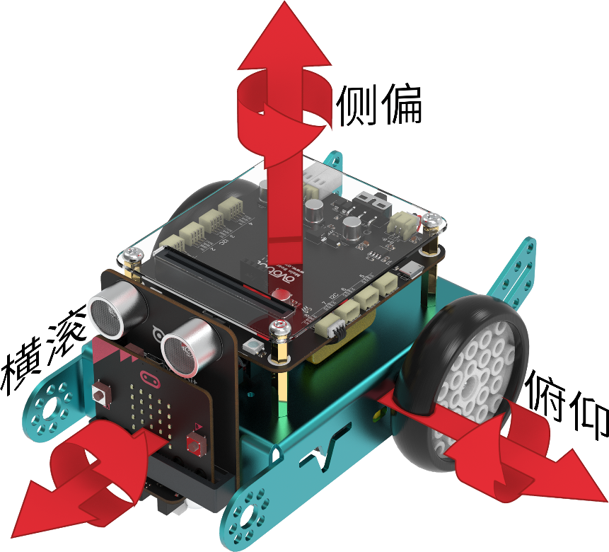

例子：

.. image:: images/gyro_example.png
   :width: 296

当绿旗被点击时，点阵屏的LED灯左右侧均为红色，如果陀螺仪的俯仰角度大于200，那么点阵屏的LED灯左右侧均变为橙色。

姿态角程序块
""""""""""""

.. image:: images/attitude.png
   :width: 92

反馈Bit侧偏的角度。

例子：

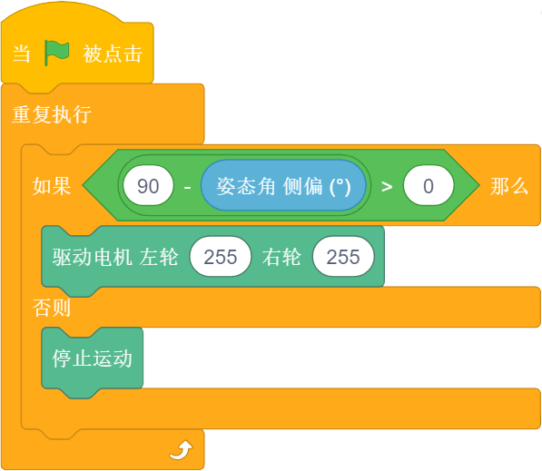

当绿旗被点击时，如果姿态角的侧偏小于90度，那么Bit机器人以255的速度前进，否则机器人停止运动。

指南针角度程序块
""""""""""""""""

.. image:: images/compass_angle.png
   :width: 89

返回Bit机器人头部朝向与地球北极方向的夹角，数值范围为顺时针0~359度。

下图标记位置为Bit机器人的电子罗盘传感器，与加速度传感器为一颗芯片，即一颗芯片上集成了加速度和电子罗盘两种传感器。
电子罗盘可以检测空间中的磁场强度，尤其可以指示地球北极的朝向。
现在大部分的智能手机里都集成了电子罗盘传感器，手机里的指南针应用就是利用这个传感器的数值来指示地球南极或北极的朝向的。

.. image:: images/compass.png
   :width: 311

下图所示箭头方向为Bit机器人的加速度传感器的三个轴的方向，正号代表往这个方向的加速度为正值，反之为负值。

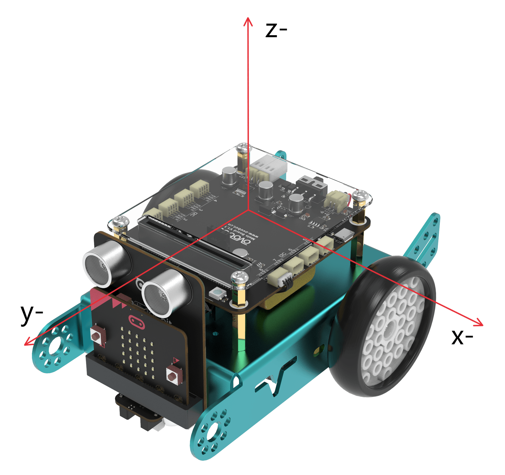

例子：

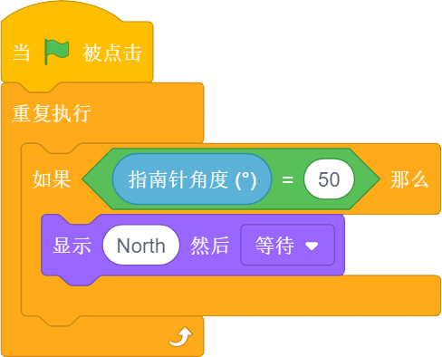

当绿旗被点击时，判断指南针的角度，如果指南针的角度等于50，那么点阵屏显示“North”然后等待。

指南针磁场强度程序块
""""""""""""""""""""

.. image:: images/compass_magnetic_density.png
   :width: 96.5

反馈当前环境中总磁场强度，单位是纳特斯拉。用磁铁靠近电子罗盘，看看磁场强度有什么变化。

例子：

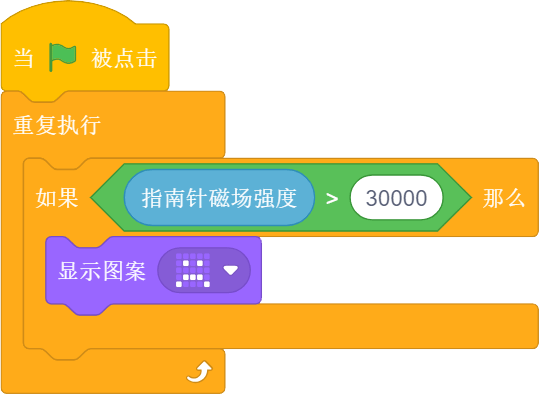

当绿旗被点击时，判断指南针磁场强度，如果磁场强度大于30000，那么点阵屏显示沮丧脸。

温度程序块
"""""""""""

.. image:: images/temperature.png
   :width: 62.5

反馈温度传感器检测到的温度值。

亮度级别程序块
""""""""""""""

.. image:: images/light_level.png
   :width: 62.5

反馈光敏传感器感应环境光线的强度。可以尝试修改亮度级别，看看不同级别对应什么样的亮度。

下图标记位置为Bit机器人的光敏传感器。可以感受环境光的强弱，并反馈相对应的电信号。
但我们这里的光敏传感器跟市面上的其他光敏传感器有所不同，如图中标记的位置是Bit机器人的点阵屏幕，怎么又会是光敏传感器呢？
点阵屏幕是由LED组成的，当LED电流反向流动时它就会对光线敏感，尤其会对它发出光的颜色的光线敏感。
所以这里我们可以使用点阵屏幕来感应光线的强弱。

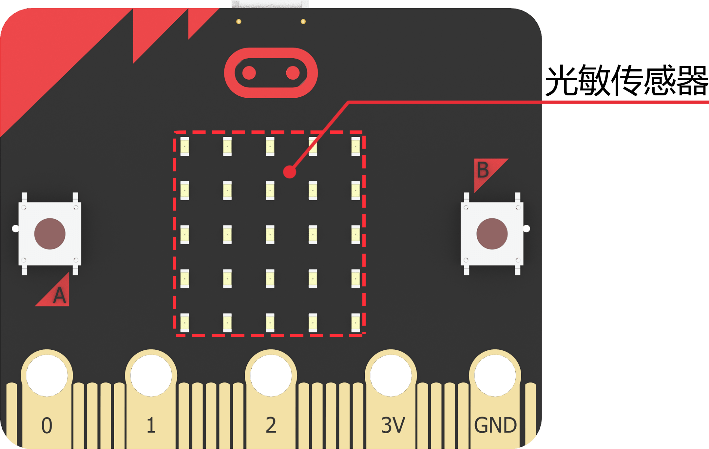

例子：

.. image:: images/light_level_example.png
   :width: 281.5

当绿旗被点击时，光敏传感器感应环境光线的强度，如果亮度级别小于10，那么点阵屏的LED灯左右侧均为绿色，否则均为橙色。

运行时间程序块
""""""""""""""

反馈Bit机器人的运行时间。

超声波传感器距离程序块
""""""""""""""""""""""

反馈Bit机器人超声波传感器检测到的距离。

超声波传感器检测到障碍物程序块
""""""""""""""""""""""""""""""

.. image:: images/sonar_close.png
   :width: 244.5

反馈Bit机器人超声波传感器有没有检测到障碍物。

巡线传感器数值程序块
""""""""""""""""""""

可以分别反馈巡线传感器左右两个光电对管检测的灰度值，黑色物体的返回值接近0，白色物体返回值接近255。

例子：

.. image:: images/read_line_from_example.png
   :width: 340.5

当绿旗被点击时，如果左侧巡线传感器的模块1检测到灰度值大于50，那么Bit机器人以100的速度前进，否则停止运动。

巡线传感器检测到颜色程序块
""""""""""""""""""""""""""

分别用于判断巡线传感器左侧或者右侧是否检测到黑色或白色，条件成立时返回为真。

例子：

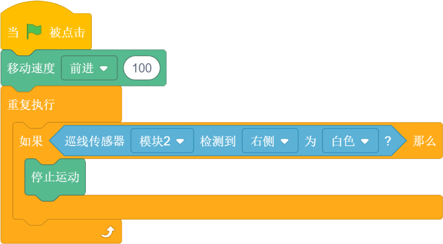

当绿旗被点击时，Bit机器人以100的速度前进，如果巡线传感器的模块2检测到右侧为白色，那么停止运动。

运算
-----

算术运算程序块
"""""""""""""""

.. image:: images/plus_subtract_multiply_divide.png
   :width: 80.5

对输入1和输入2的数字分别进行加减乘除的运算。

取随机数程序块
""""""""""""""""

.. image:: images/pick_random.png
   :width: 186

在输入1和输入2之间取一个随机的数值。

例子：

当绿旗被点击时，点阵屏显示所输入的数字1和10之间的随机数，然后执行下一条指令。

条件判断程序块
"""""""""""""""

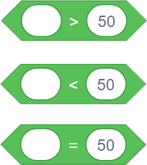

分别为判断左面圆角矩形框内的数值是否大于、小于或等于右面的数值。

例子：

.. image:: images/compare_example.png
   :width: 349.5

当绿旗被点击时，如果超声波传感器检测到距离小于50，那么显示图案“❤”。

逻辑与程序块
"""""""""""""

.. image:: images/and.png
   :width: 102

当两个六边形框内的条件都满足时，都返回真。

逻辑或程序块
"""""""""""""

当两个六边形框内的任一条件满足时，都返回真。

例子：

.. image:: images/or_example.png
   :width: 469.5

当绿旗被点击时，Bit机器人以100的速度前进，如果超声波传感器检测到距离小于10或按键A被按下，那么点阵屏显示图案沮丧脸。

条件不成立程序块
""""""""""""""""

.. image:: images/not.png
   :width: 93.5

当六边形框内的条件不满足时反馈为真。

例子：

.. image:: images/not_example.png
   :width: 363

当绿旗被点击时，如果超声波传感器检测到障碍物的距离等于15这个事件不成立的话，点阵屏显示沮丧脸，否则显示笑脸。

数组程序块
"""""""""""

数组数字程序块
""""""""""""""

.. image:: images/create_list_with.png
   :width: 191.5

连接程序块
"""""""""""

.. image:: images/join.png
   :width: 161.5

设置连接物的字符程序块
""""""""""""""""""""""

.. image:: images/letter_of.png
   :width: 156

设置链接物字符
"""""""""""""""

.. image:: images/length_of.png
   :width: 105.5

判断包含程序块
"""""""""""""""

取余程序块
""""""""""

.. image:: images/mod.png
   :width: 141

第一个圆角矩形框内的数值除以第二个圆角矩形框内的数值的余数。

例子：

当绿旗被点击时，点阵屏显示所输入的数字10除以9的余数，然后执行下一条指令。

四舍五入程序块
""""""""""""""

取圆角矩形框内数据的整数，小数满0.5，整数位加1。

例子：

当绿旗被点击时，点阵屏显示所输入的数字4.5四舍五入后的数字，然后执行下一条指令。

绝对值程序块
"""""""""""""

把一个数变成非负数，正数的绝对值是它本身，负数的绝对值是它的相反数，0的绝对值是0。

变量
-----

设置变量程序块
"""""""""""""""

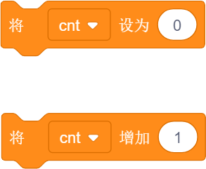

在这里你可以自己创建一个变量，变量是一个可变的量，与常数相对，可以用来传递变化的数值。
如设置变量为一个数值或者将变量增加一个数值等。

例子：

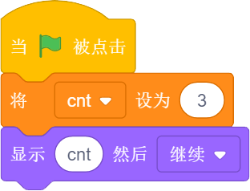

当绿旗被点击时，将cnt变量设为3，点阵屏显示变量cnt然后执行下一条指令。

显示/隐藏变量程序块
"""""""""""""""""""

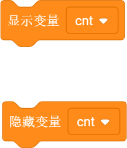

