Ovobot Bit Scratch指南
========================

以下是使用Scratch给Ovobot Bit机器人编程的快速参考，如果你是第一次给机器人编程请先阅读接下来的部分：

.. toctree::
   :maxdepth: 1

   tutorial/index

运动
-----

设置移动速度程序块
"""""""""""""""""""

设置Bit的前进或后退的速度，数值范围为0~255。

例子：

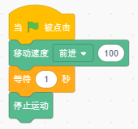

设置移动速度及时间程序块
""""""""""""""""""""""""

通过设定机器人运动方向、运动速度和持续时间来让机器人运动，速度范围为0~255。

例子：

   
设置旋转速度程序块
"""""""""""""""""""

控制机器人原地旋转，设置向左或者向右的旋转速度，速度范围为0~255。

例子：

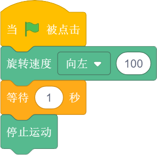

设置旋转速度及时间程序块
"""""""""""""""""""""""""

控制机器人原地旋转，设置向左或者向右的旋转速度以及持续时间，速度范围为0~255。

例子：

停止运动程序块
"""""""""""""""

设置左右两个电机的运动速度为0。

例子：

驱动电机程序块
"""""""""""""""

分别驱动Bit的左右两个轮子的转速，通过设置左右轮子的不同转速，使机器人以设置的角度边旋转边前进。

如通过电脑键盘的方向键控制Bit前进、后退、左转和右转，空格键控制Bit停止。

.. image:: images/rotate_example.png
   :width: 440

例子：

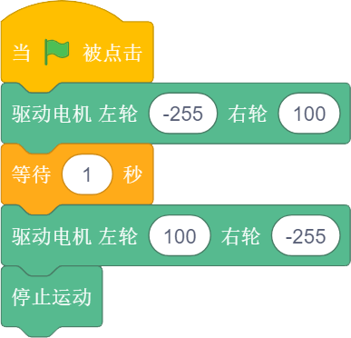

外观
-----

RGB LED灯颜色设置程序块
""""""""""""""""""""""""

可以分别设置左右两侧LED灯的颜色。

例子：

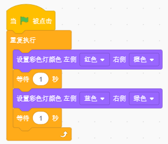

显示字符程序块
"""""""""""""""

可以控制Bit机器人点阵屏显示相应的字符，选择“等待”即执行完这条指令才会执行下一条指令，
“继续”即执行这条指令同时执行下一条指令。

显示图案程序块
"""""""""""""""

可以控制Bit机器人点阵屏显示绘制的图案，绘制图案时，可以一键熄灭或点亮所有LED，点击灰色小方格点亮相应的LED。

例子：

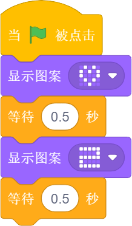

熄灭屏幕程序块
"""""""""""""""

熄灭Bit机器人LED点阵屏。

例子：

点亮坐标程序块
"""""""""""""""

点亮Bit机器人LED点阵屏上某个坐标的LED，x、y的数值范围为0~4，零点在点阵屏的左上角，水平向右为x轴，竖直向下为y轴。

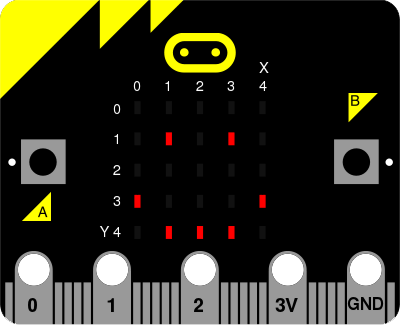

例子：

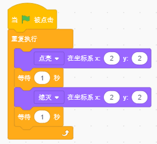

设置坐标程序块
"""""""""""""""

分别设置x或y轴的高度。

声音
-----

播放音符程序块
"""""""""""""""

简谱和音名的对应关系：我们在生活中，一般接触到的都是1234567这样的简谱，但Ovoblock的程序块是使用五线谱的音名来显示的，在C调的乐谱中，它们之间的对应关系如下。

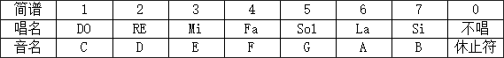

C调中，C、D、E、F、G、A、B分别对应简谱中的1、2、3、4、5、6、7，一个唱名为四分音符持续1个节拍，下方有一个横杠的是八分音符持续1/2节拍，音符后有一个横杠的为二分音符持续2个节拍，同学们按照音符和节拍数编写整段音乐。

比如下面的上学歌，不划线是四分音符，在这首曲子中是一个节拍，一道下划线的节拍相当于八分音，在这首曲子中是1/2拍。
一些音符后面会加-，表示音符持续，例如7 - 代表 7 这个音占了两个节拍，7- - 则表示3个节拍。

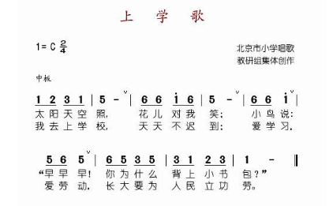

例子：

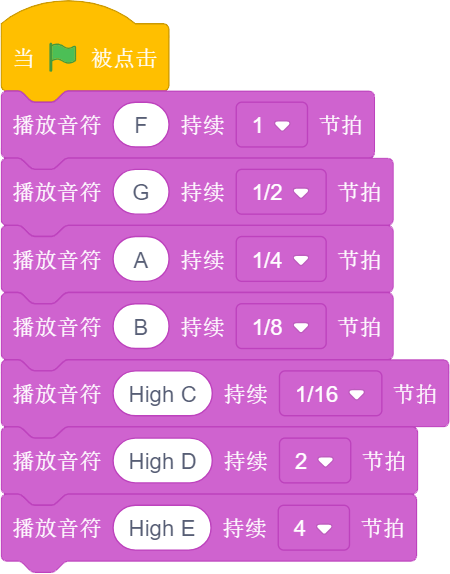

暂停播放节拍程序块
"""""""""""""""""""

设置暂停播放的节拍数。

引脚
-----

引脚被接触程序块
"""""""""""""""""

判断引脚是否被接触。

读取引脚模拟值程序块
"""""""""""""""""""""

读取设置引脚的模拟值。

设置引脚模拟值程序块
""""""""""""""""""""

.. image:: images/set_analog_quantity.png
   :width: 193.5

设置选定引脚的模拟值。

读取引脚数字值程序块
""""""""""""""""""""

读取设置引脚的数字值。

设置引脚数字值程序块
""""""""""""""""""""

设置选定引脚的数字值。

无线通讯
--------

控制无线通讯程序块
"""""""""""""""""""

控制打开、接收、复位无线通讯。

发送无线消息程序块
""""""""""""""""""

.. image:: images/send_wireless_message.png
   :width: 122

发送无线消息。

发送无线消息列表程序块
""""""""""""""""""""""

发送无线消息列表。

接收无线消息程序块
""""""""""""""""""

接收无线消息。

接收无线消息列表程序块
""""""""""""""""""""""

.. image:: images/receive_wireless_containing.png
   :width: 106
   
接收无线消息列表。

设置无线讯息频道程序块
""""""""""""""""""""""

   
设置无线讯息频道。

事件
-----

程序的起点
"""""""""""

当机器人处于实时模式时，点击绿旗，执行此模块下方的程序。

当机器人处于离线模式时，启动Ovobot Bit，执行此模块下方的程序。

例子：

.. image:: images/click_example.png
   :width: 188

键盘按键按下事件程序块
"""""""""""""""""""""""

键盘按键共包含42种可编程按键，由方向键、数字键、字母键组成，当对应的按键被按下时，执行此模块下方的程序。

例子：

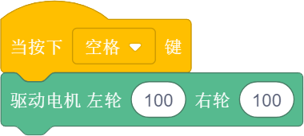

当按钮按下事件程序块
"""""""""""""""""""""

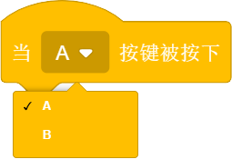

按钮指的是micro:bit的两个可编程按键，分为A和B，当对应Bit的按钮被按下时，执行此模块下方的程序。

例子：

当红外遥控器按键按下程序块
""""""""""""""""""""""""""

Ovobot Bit有红外接收模块，可用于红外遥控器控制机器人的运动、图案、声音等。
按键共包含42种可编程按键，由方向键、数字键、字母键组成，当红外遥控器对应的按钮被按下时，执行此模块下方的程序。

红外遥控器是一种利用红外发光二极管，以红外光为载体将按键端信息传递给接收端的设备。

红外遥控器：

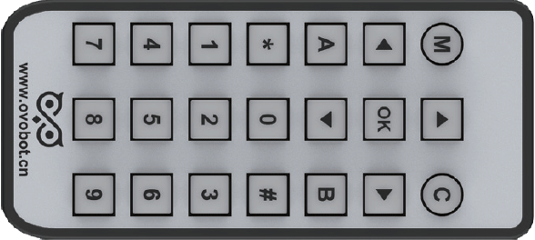

用离线模式，把程序下载到Bit里，通过遥控器的4个方向键，来控制Bit前进，后退，左转，右转。程序下载到Bit机器人开始执行，根据按下不同的按键执行相应的运动程序。

Bit程序：

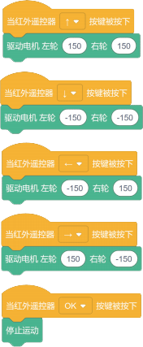

例子：

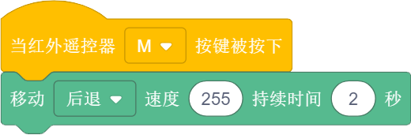

当响度大于程序块
"""""""""""""""""

响度返回的值是声音传感器返回的值，数值范围为0～255，当响度大于设置数值时，执行此模块下方的程序。

当接收到消息程序块
""""""""""""""""""

当接收到设定消息时，执行此模块下方的程序。

例子：

广播程序块
"""""""""""

广播程序块是不同角色之间通信的桥梁，一个角色可以广播一个消息，另外一个角色可以侦听这个消息，当接收到消息时执行相应的程序。

例子：

广播并等待程序块
"""""""""""""""""

一个角色可以广播一个消息并等待。

控制
-----

等待N秒程序块
""""""""""""""

等待N秒后执行其下方的程序，N为圆角矩形框内的数值。

例子：

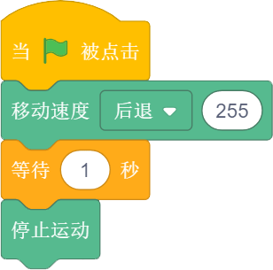

重复执行N次程序块
""""""""""""""""""

重复执行其内部程序N次，N为圆角矩形框中的数值。

例子：

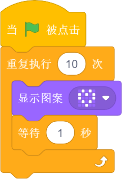

重复执行程序块
"""""""""""""""

重复执行程序块内部包含的程序。

例子：

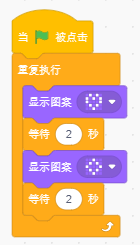

如果……那么……程序块
""""""""""""""""""

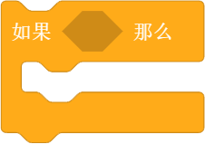

当六边形框内的条件满足时执行程序块内部的程序。

例子：

.. image:: images/if_then_example.png
   :width: 221.5

如果……那么……否则程序块
"""""""""""""""""""""""

当六边形框内的条件满足时执行那么内部的程序，不满足时执行否则内部的程序。

例子：

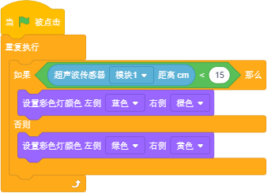

等待直到程序块
"""""""""""""""

等待直到条件为真时才继续执行接下来的程序块。

重复直到程序块
"""""""""""""""

重复执行其内部的程序，直到六边形框内的条件满足，才执行程序块下方的程序。

例子：

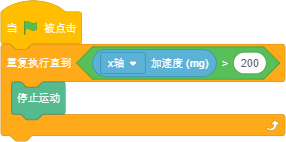

侦测
-----

判断按钮按下事件程序块
"""""""""""""""""""""""

选择机器人按键触发事件的回调函数。

红外遥控器按键判断程序块
""""""""""""""""""""""""

.. image:: images/IR_Remote_Controller.png
   :width: 202.5

如果M按键按下的话，返回值就是True, 否则返回值是false。

例子：

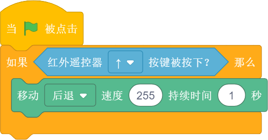

判断Bit姿态程序块
""""""""""""""""""

判断机器人的姿态，执行程序块下方的程序。

加速度程序块
""""""""""""""

返回Bit的x、y和z三个轴的加速度值。

例子：

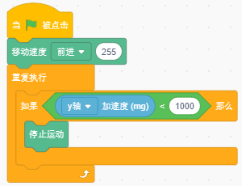

响度程序块
"""""""""""

我们用响度来表示声音传感器的反馈值，响度的范围大小是0-255。

例子：

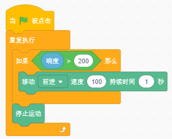

电池电量程序块
"""""""""""""""

电池电量模块可以实时显示Bit的百分比电量。

陀螺仪程序块
""""""""""""

陀螺仪程序块用来反馈Bit的俯仰、横滚和侧偏的角速度。
下图主板上的标记位置为Bit机器人的陀螺仪传感器，陀螺仪传感器可用于检测Bit的旋转角速度，并可以计算旋转的角度。

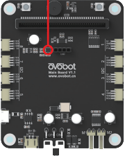

下图所示分别为Bit的俯仰、横滚和偏航对应的轴和方向。

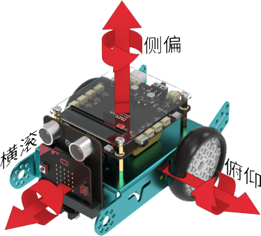

例子：

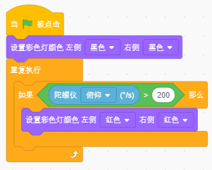

姿态角程序块
""""""""""""

反馈Bit侧偏的角度。

例子：

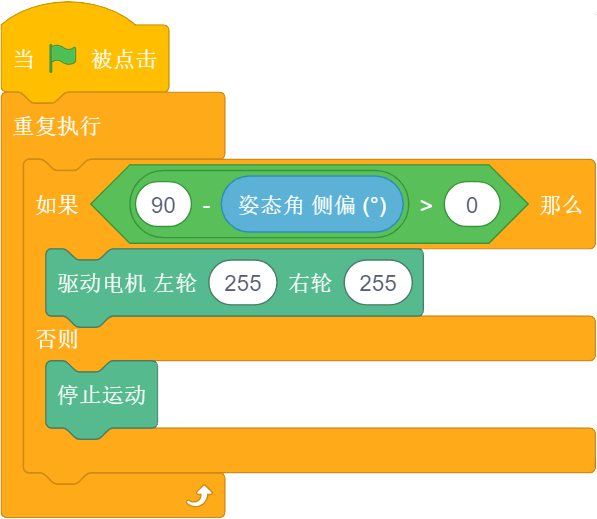

指南针角度程序块
""""""""""""""""

返回Bit机器人头部朝向与地球北极方向的夹角，数值范围为顺时针0~359度。

下图标记位置为Bit机器人的电子罗盘传感器，与加速度传感器为一颗芯片，即一颗芯片上集成了加速度和电子罗盘两种传感器。
电子罗盘可以检测空间中的磁场强度，尤其可以指示地球北极的朝向。
现在大部分的智能手机里都集成了电子罗盘传感器，手机里的指南针应用就是利用这个传感器的数值来指示地球南极或北极的朝向的。

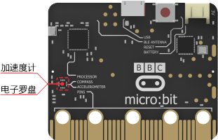

下图所示箭头方向为Bit机器人的加速度传感器的三个轴的方向，正号代表往这个方向的加速度为正值，反之为负值。

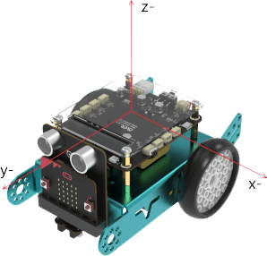

例子：

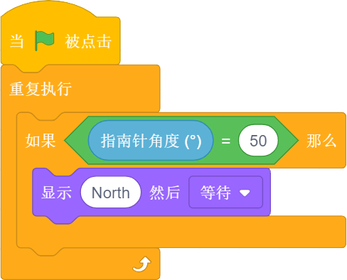

指南针磁场强度程序块
""""""""""""""""""""

反馈当前环境中总磁场强度，单位是纳特斯拉。用磁铁靠近电子罗盘，看看磁场强度有什么变化。

例子：

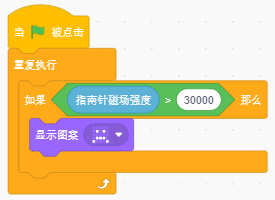

温度程序块
"""""""""""

反馈温度传感器检测到的温度值。

亮度级别程序块
""""""""""""""

反馈光敏传感器感应环境光线的强度。可以尝试修改亮度级别，看看不同级别对应什么样的亮度。

例子：

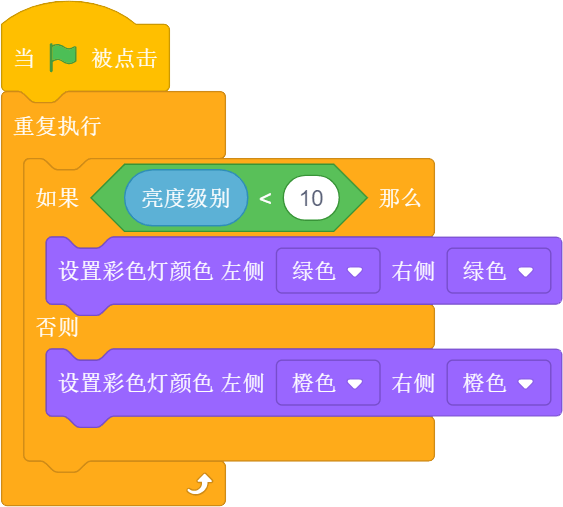

运行时间程序块
""""""""""""""

反馈Bit机器人的运行时间。

超声波传感器距离程序块
""""""""""""""""""""""

反馈Bit机器人超声波传感器检测到的距离。

超声波传感器检测到障碍物程序块
""""""""""""""""""""""""""""""

反馈Bit机器人超声波传感器有没有检测到障碍物。

巡线传感器数值程序块
""""""""""""""""""""

可以分别反馈巡线传感器左右两个光电对管检测的灰度值，黑色物体的返回值接近0，白色物体返回值接近255。

例子：

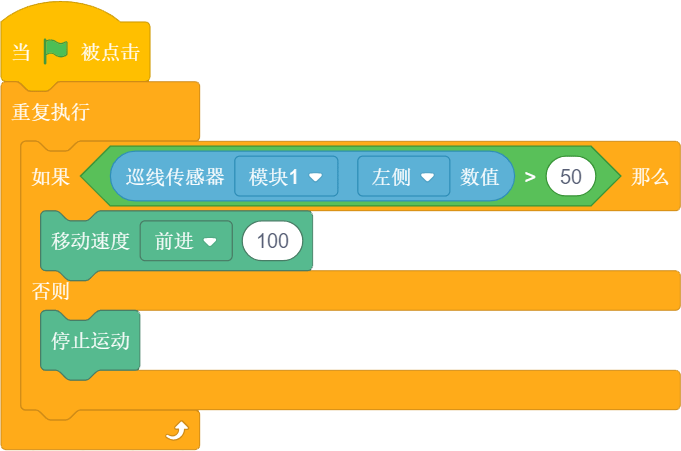

巡线传感器检测到颜色程序块
""""""""""""""""""""""""""

分别用于判断巡线传感器左侧或者右侧是否检测到黑色或白色，条件成立时返回为真。

例子：

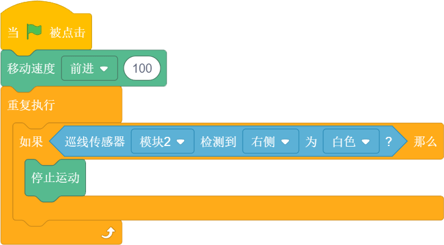

运算
-----

算术运算程序块
"""""""""""""""

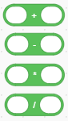

对输入1和输入2的数字分别进行加减乘除的运算。

取随机数程序块
""""""""""""""""

在输入1和输入2之间取一个随机的数值。

例子：

条件判断程序块
"""""""""""""""

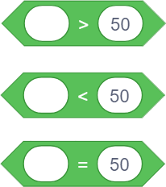

分别为判断左面圆角矩形框内的数值是否大于、小于或等于右面的数值。

例子：

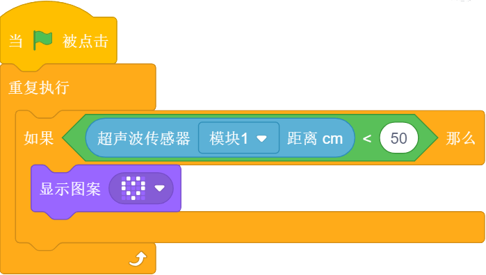

逻辑与程序块
"""""""""""""

当两个六边形框内的条件都满足时，都返回真。

逻辑或程序块
"""""""""""""

当两个六边形框内的任一条件满足时，都返回真。

例子：

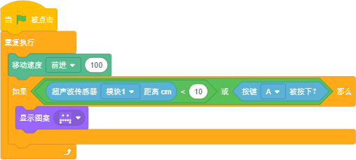

条件不成立程序块
""""""""""""""""

当六边形框内的条件不满足时反馈为真。

例子：

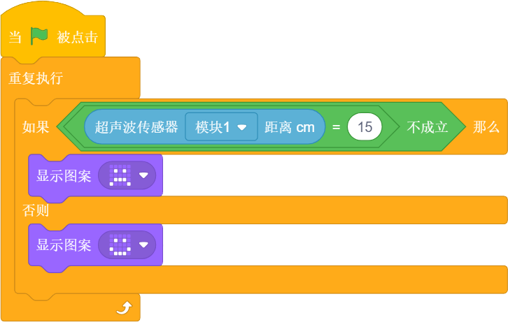

数组程序块
"""""""""""

数组数字程序块
""""""""""""""

连接程序块
"""""""""""

设置连接物的字符程序块
""""""""""""""""""""""

设置链接物字符
"""""""""""""""

判断包含程序块
"""""""""""""""

取余程序块
""""""""""

第一个圆角矩形框内的数值除以第二个圆角矩形框内的数值的余数。

例子：

四舍五入程序块
""""""""""""""

取圆角矩形框内数据的整数，小数满0.5，整数位加1。

例子：

绝对值程序块
"""""""""""""

把一个数变成非负数，正数的绝对值是它本身，负数的绝对值是它的相反数，0的绝对值是0。

变量
-----

变量程序块
"""""""""""

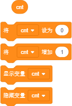

在这里你可以自己创建一个变量，变量是一个可变的量，与常数相对，可以用来传递变化的数值。
如设置变量为一个数值或者将变量增加一个数值等。

例子：

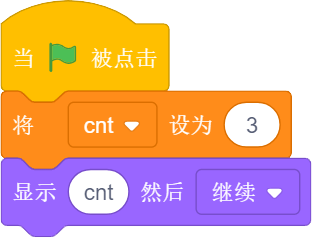

