Ovobot Bit Scratch指南
========================

以下是使用Scratch给Ovobot Bit机器人编程的快速参考，如果你是第一次给机器人编程请先阅读接下来的部分：

.. toctree::
   :maxdepth: 1

   tutorial/index

运动
-----

设置移动速度程序块
"""""""""""""""""""

.. image:: images/move.png
   :width: 154

设置Bit的前进或后退的速度，数值范围为0~255。

例子：

设置移动速度及时间程序块
""""""""""""""""""""""""

通过设定机器人运动方向、运动速度和持续时间来让机器人运动，速度范围为0~255。

例子：

   
设置旋转速度程序块
"""""""""""""""""""

控制机器人原地旋转，设置向左或者向右的旋转速度，速度范围为0~255。

例子：

设置旋转速度及时间程序块
"""""""""""""""""""""""""

控制机器人原地旋转，设置向左或者向右的旋转速度以及持续时间，速度范围为0~255。

例子：

停止运动程序块
"""""""""""""""

设置左右两个电机的运动速度为0。

例子：

驱动电机程序块
"""""""""""""""

分别驱动Bit的左右两个轮子的转速。

例子：

外观
-----

RGB LED灯颜色设置程序块
""""""""""""""""""""""""

可以分别设置左右两侧LED灯的颜色。

例子：

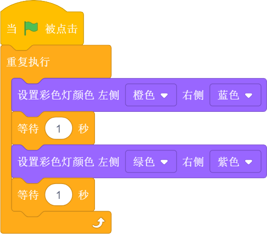

显示字符程序块
"""""""""""""""

可以控制Bit机器人点阵屏显示相应的字符。

显示图案程序块
"""""""""""""""

.. image:: images/show_image.png
   :width: 109

可以控制Bit机器人点阵屏显示相应的图案。

例子：

熄灭屏幕程序块
"""""""""""""""

.. image:: images/hide_all_matrix.png
   :width: 57

熄灭Bit机器人LED点阵屏。

例子：

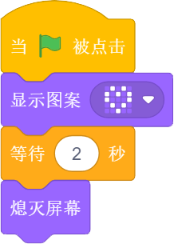

点亮坐标程序块
"""""""""""""""

点亮Bit机器人LED点阵屏上某个坐标的LED，x、y的数值范围为0~4，零点在点阵屏的左上角，水平向右为x轴，竖直向下为y轴。

例子：

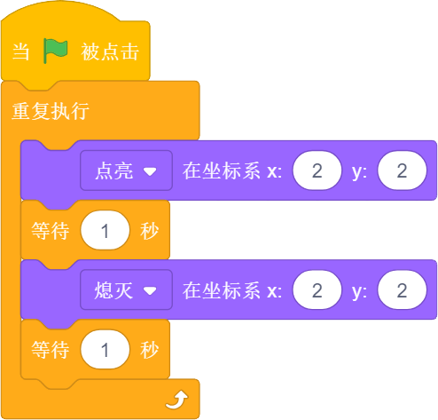

设置坐标程序块
"""""""""""""""

.. image:: images/show_on_the_axis.png
   :width: 216.5

分别设置x或y轴的高度。

声音
-----

播放音符程序块
"""""""""""""""

可以选择播放的音符和音符播放的节拍数。

例子：

.. image:: images/play_tone_example.png
   :width: 197

暂停播放节拍程序块
"""""""""""""""""""

.. image:: images/rest.png
   :width: 152

设置暂停播放的节拍数。

引脚
-----

引脚被接触程序块
"""""""""""""""""

判断引脚是否被接触。

读取引脚模拟值程序块
"""""""""""""""""""""

读取设置引脚的模拟值。

设置引脚模拟值程序块
""""""""""""""""""""

设置选定引脚的模拟值。

读取引脚数字值程序块
""""""""""""""""""""

.. image:: images/pin_with_numbber_input.png
   :width: 154.5

读取设置引脚的数字值。

设置引脚数字值程序块
""""""""""""""""""""

设置选定引脚的数字值。

无线通讯
--------

控制无线通讯程序块
"""""""""""""""""""

控制打开、接收、复位无线通讯。

发送无线消息程序块
""""""""""""""""""

.. image:: images/send_wireless_message.png
   :width: 122

发送无线消息。

发送无线消息列表程序块
""""""""""""""""""""""

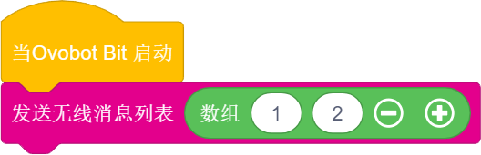

发送无线消息列表。

接收无线消息程序块
""""""""""""""""""

接收无线消息。

接收无线消息列表程序块
""""""""""""""""""""""

   
接收无线消息列表。

设置无线讯息频道程序块
""""""""""""""""""""""

   
设置无线讯息频道。

事件
-----

程序的起点
"""""""""""

.. image:: images/click.png
   :width: 85

当绿旗被点击时，执行此模块下方的程序。

例子：

键盘按键按下事件程序块
"""""""""""""""""""""""

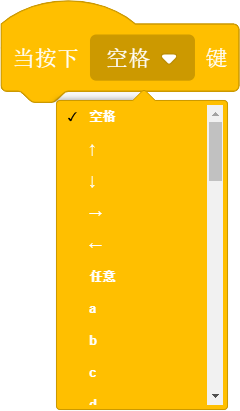

当对应的键盘按键被按下是执行其下方的程序。

例子：

当按钮按下事件程序块
"""""""""""""""""""""

当Bit对应的按钮被按下时，则会执行程序块下方的程序。

例子：

.. image:: images/button_pressed_example.png
   :width: 127.5

当红外遥控器按键按下程序块
""""""""""""""""""""""""""

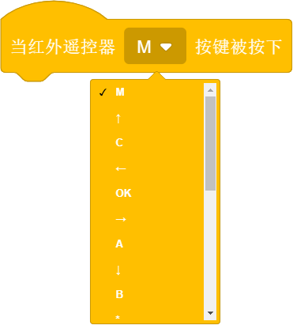

当红外遥控器对应的按钮被按下时，则会执行程序块下方的程序。

例子：

当响度大于程序块
"""""""""""""""""

当响度大于设置数值时，则会执行程序块下方的程序。

当接收到消息程序块
""""""""""""""""""

当接收到设定消息时，则会执行程序块下方的程序。

例子：

广播程序块
"""""""""""

.. image:: images/broadcast.png
   :width: 98.5

广播程序块是不同角色之间通信的桥梁，一个角色可以广播一个消息，另外一个角色可以侦听这个消息，当接收到消息时执行相应的程序。

例子：

.. image:: images/button_pressed_example.png
   :width: 127.5

广播并等待程序块
"""""""""""""""""

一个角色可以广播一个消息并等待。

控制
-----

等待N秒程序块
""""""""""""""

等待N秒后执行其下方的程序，N为圆角矩形框内的数值。

例子：

.. image:: images/wait_seconds_example.png
   :width: 154

重复执行N次程序块
""""""""""""""""""

重复执行其内部程序N次，N为圆角矩形框中的数值。

例子：

.. image:: images/repeat_example.png
   :width: 120

重复执行程序块
"""""""""""""""

重复执行程序块内部包含的程序。

例子：

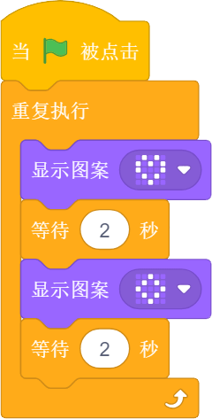

如果……那么……程序块
""""""""""""""""""

当六边形框内的条件满足时执行程序块内部的程序。

例子：

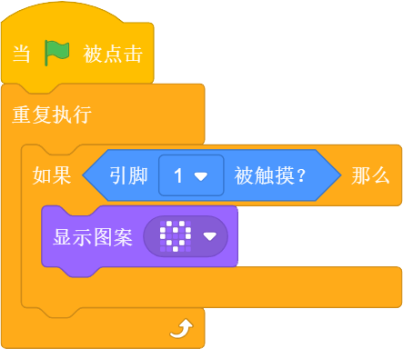

如果……那么……否则程序块
"""""""""""""""""""""""

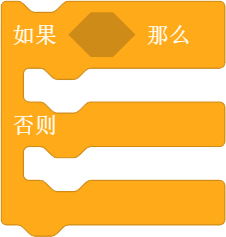

当六边形框内的条件满足时执行那么内部的程序，不满足时执行否则内部的程序。

例子：

.. image:: images/if_then_else_example.png
   :width: 338

等待直到程序块
"""""""""""""""

等待直到条件为真时才继续执行接下来的程序块。

重复直到程序块
"""""""""""""""

重复执行其内部的程序，直到六边形框内的条件满足，才执行程序块下方的程序。

例子：

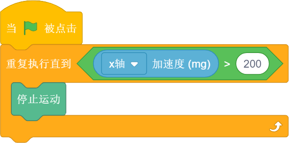

侦测
-----

判断按钮按下事件程序块
"""""""""""""""""""""""

.. image:: images/button.png
   :width: 144.5

选择机器人按键触发事件的回调函数。

红外遥控器按键判断程序块
""""""""""""""""""""""""

如果M按键按下的话，返回值就是True, 否则返回值是false。

例子：

.. image:: images/IR_Remote_Controller_example.png
   :width: 262

判断Bit姿态程序块
""""""""""""""""""

.. image:: images/gesture.png
   :width: 148.5

判断机器人的姿态，执行程序块下方的程序。

加速度程序块
""""""""""""""

.. image:: images/acceleration.png
   :width: 129.5

返回Bit的x、y和z三个轴的加速度值。

例子：

.. image:: images/acceleration_example.png
   :width: 296

响度程序块
"""""""""""

.. image:: images/loudness_Modular.png
   :width: 40

我们用响度来表示声音传感器的反馈值，响度的范围大小是0-255。

例子：

.. image:: images/loudness_Modular_example.png
   :width: 283

电池电量程序块
"""""""""""""""

电池电量模块可以实时显示Bit的百分比电量。

陀螺仪程序块
""""""""""""

.. image:: images/gyro.png
   :width: 135

反馈Bit的俯仰、横滚和侧偏的角速度。

例子：

.. image:: images/gyro_example.png
   :width: 296

姿态角程序块
""""""""""""

反馈Bit侧偏的角度。

例子：

.. image:: images/attitude_example.png
   :width: 298.5

指南针角度程序块
""""""""""""""""

.. image:: images/compass_angle.png
   :width: 89

返回Bit机器人头部朝向与地球北极方向的夹角，数值范围为顺时针0~359度。

例子：

.. image:: images/compass_angle_example.png
   :width: 244

指南针磁场强度程序块
""""""""""""""""""""

.. image:: images/compass_magnetic_density.png
   :width: 96.5

反馈当前环境中总磁场强度，单位是纳特斯拉。用磁铁靠近电子罗盘，看看磁场强度有什么变化。

例子：

.. image:: images/compass_magnetic_density_example.png
   :width: 269.5

温度程序块
"""""""""""

.. image:: images/temperature.png
   :width: 62.5

反馈温度传感器检测到的温度值。

亮度级别程序块
""""""""""""""

反馈光敏传感器感应环境光线的强度。可以尝试修改亮度级别，看看不同级别对应什么样的亮度。

例子：

运行时间程序块
""""""""""""""

.. image:: images/running_time.png
   :width: 88

反馈Bit机器人的运行时间。

超声波传感器距离程序块
""""""""""""""""""""""

.. image:: images/sonar_sensor_distance.png
   :width: 194.5

反馈Bit机器人超声波传感器检测到的距离。

超声波传感器检测到障碍物程序块
""""""""""""""""""""""""""""""

反馈Bit机器人超声波传感器有没有检测到障碍物。

巡线传感器数值程序块
""""""""""""""""""""

.. image:: images/read_line_from.png
   :width: 228.5

可以分别反馈巡线传感器左右两个光电对管检测的灰度值，黑色物体的返回值接近0，白色物体返回值接近255。

例子：

.. image:: images/read_line_from_example.png
   :width: 370

巡线传感器检测到颜色程序块
""""""""""""""""""""""""""

.. image:: images/line_follower_detects.png
   :width: 332.5

分别用于判断巡线传感器左侧或者右侧是否检测到黑色或白色，条件成立时返回为真。

例子：

.. image:: images/line_follower_detects_example.png
   :width: 396

运算
-----

算术运算程序块
"""""""""""""""

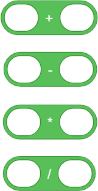

对输入1和输入2的数字分别进行加减乘除的运算。

取随机数程序块
""""""""""""""""

在输入1和输入2之间取一个随机的数值。

例子：

.. image:: images/pick_random_example.png
   :width: 310

条件判断程序块
"""""""""""""""

.. image:: images/compare.png
   :width: 103

分别为判断左面圆角矩形框内的数值是否大于、小于或等于右面的数值。

例子：

逻辑与程序块
"""""""""""""

当两个六边形框内的条件都满足时，都返回真。

逻辑或程序块
"""""""""""""

.. image:: images/or.png
   :width: 102

当两个六边形框内的任一条件满足时，都返回真。

例子：

.. image:: images/or_example.png
   :width: 508

条件不成立程序块
""""""""""""""""

当六边形框内的条件不满足时反馈为真。

例子：

数组程序块
"""""""""""

.. image:: images/create_empty_list.png
   :width: 62.5

数组数字程序块
""""""""""""""

连接程序块
"""""""""""

设置连接物的字符程序块
""""""""""""""""""""""

设置链接物字符
"""""""""""""""

判断包含程序块
"""""""""""""""

.. image:: images/contains.png
   :width: 145

取余程序块
""""""""""

第一个圆角矩形框内的数值除以第二个圆角矩形框内的数值的余数。

例子：

.. image:: images/mod_example.png
   :width: 265.5

四舍五入程序块
""""""""""""""

.. image:: images/round.png
   :width: 90.5

取圆角矩形框内数据的整数，小数满0.5，整数位加1。

例子：

.. image:: images/round_example.png
   :width: 218

绝对值程序块
"""""""""""""

.. image:: images/abs_of.png
   :width: 109

把一个数变成非负数，正数的绝对值是它本身，负数的绝对值是它的相反数，0的绝对值是0。

变量
-----

