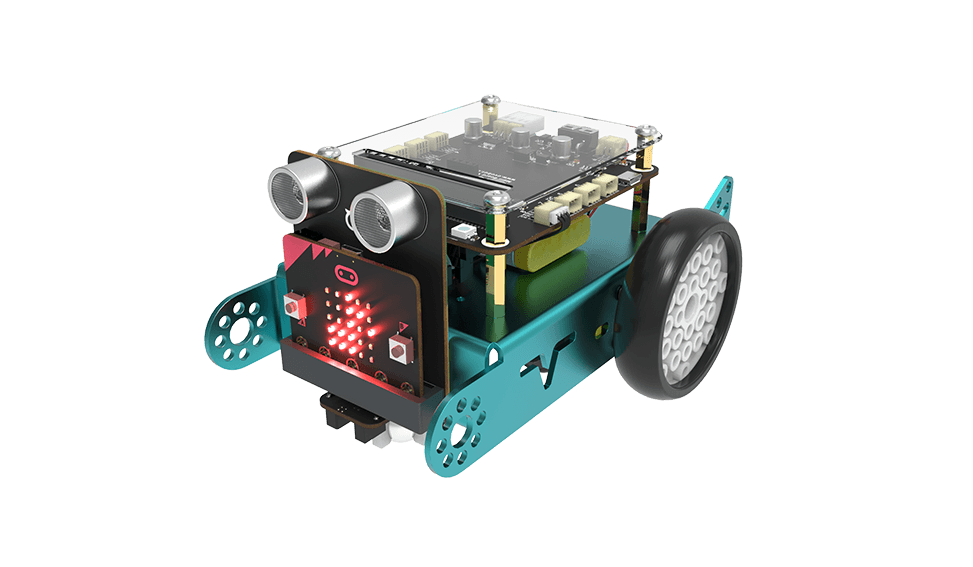

Ovobot Bit机器人简介
============================

Ovobot Bit是一款可编程机器人小车，可以使用图形化和Python编程来学习小车驱动原理以及传感器在自动驾驶汽车上的应用。

Bit搭载了超声波、巡线、加速度、陀螺仪、电子罗盘、声音、光敏、红外和温度传感器，并配有5x5点阵屏幕、蜂鸣器、音乐、RGB灯等多个输出单元。

Bit有蓝牙、2.4G和红外三种无线通信方式，机器人可以通过无线信号进行协作，也可以配合遥控器开发出远程遥控功能。结合丰富的传感器和小车载体，通过编程可以制作出多种创意机器人应用。

