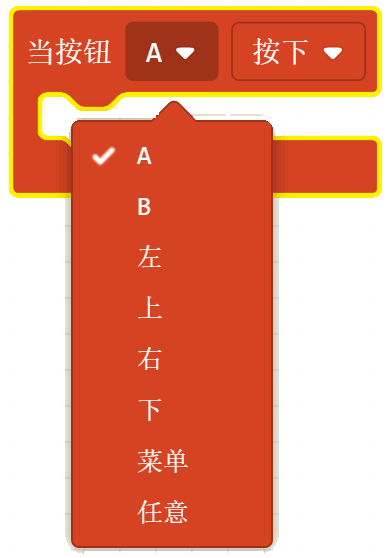
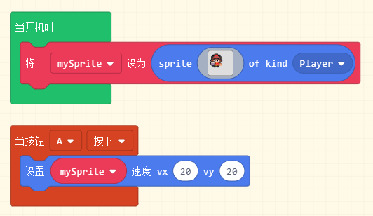
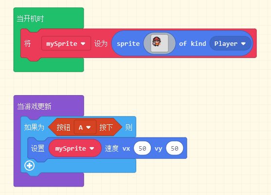
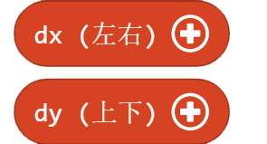
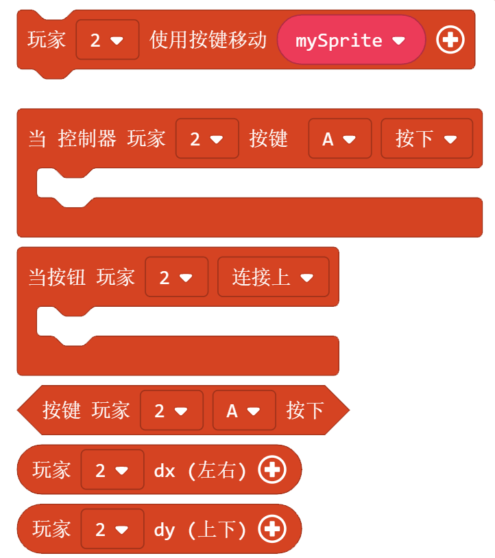

控制器
========

单人模式
----------

1. 使用键盘方向键来控制精灵的移动。后面的加号点开可以设置精灵x，y轴的移动速度（默认为100）

例子：

创建一个玩家精灵，并且用键盘方向键控制精灵向不同方向移动。

.. image:: images/control_example1.png  

2. 当按键按下，松开或者重复时，执行内部的程序。其中按钮框可以下拉选择。

例子：

创建一个玩家精灵，按键A按下时，玩家精灵按照设置的速度移动。

3. 当按键按下时，返回True. 作为一个判断条件，常常跟逻辑语句结合使用。

.. image:: images/control3.png
   :width: 183.5

例子：

同上，创建一个玩家精灵，按键A按下时，玩家精灵按照设置的速度移动。只是用了两种不同的判断方式。

4. 用于单独控制精灵x和y轴的移动，点击加号可以设置x，y轴速度（默认为100)。这个可控制器的第一个积木块的区别是X Y可以分开设置，更加灵活。

例子：

创建一个玩家精灵，并且用键盘左右方向键控制精灵X轴移动，用上下方向键控制精灵Y轴移动。(案例重写)

多人模式
----------

积木块使用方法和单人模式一样，只不过多了一个参数来设置是哪一个玩家控制的。

