场景
=====

屏幕
-----

1. 返回屏幕的宽度和高度值。

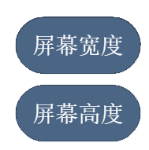

例子：

在屏幕中间显示出“宽度 X 高度”的的字符串。

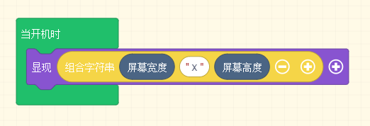

2. 设置背景的颜色和图片。

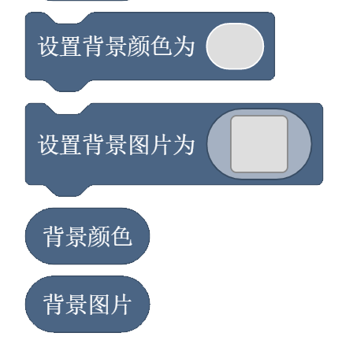

* 设置背景颜色：下拉框有16种颜色可供选择。
* 设置背景图片：背景图片可以手绘，也可以用资料库中的图片。
* 背景颜色：获取当前的背景颜色信息。
* 背景图片：获取当前的背景图片信息 

例子：

可以绘制一个自己的姓名牌。(待补图片)

特效
----
开始游戏特效以及结束游戏特效。使用方法和之前精灵特效的方法一致，区别是精灵特效针对精灵，场景特效是针对整个游戏场景。

特效下拉框可选，开始游戏特效后面的 + 号点开可以设置特效的时间。

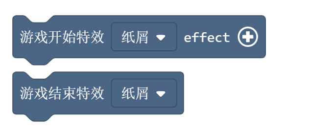

例子：

游戏开始时，开启特效，按键A按下后，停止特效。

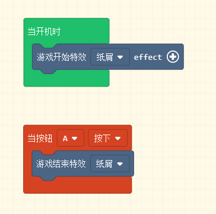

砖块
-----

1. 设置砖块地图，可以自己绘制，也可以用资料库中的图案。

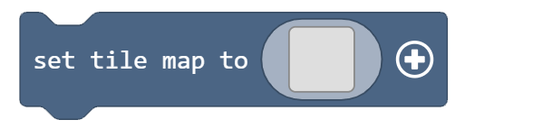

2. 对于现有的砖块，可以根据颜色来替换成别的图案。替换的图案可以自己绘制，也可以用资料库中的图案。

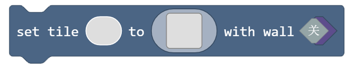

例子：

绘制台阶砖块，然后把其中粉色的砖块图案替换成橙色的方框图案。

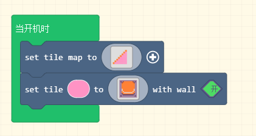

3. 定位一个砖块的位置，左上角的坐标是（0.0）。通常和下面的积木块一起使用。

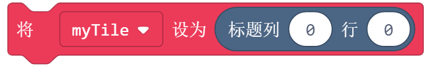

4. 设置一个已知位置的砖块颜色，可以直接根据坐标定位来设置颜色。也可以和上面的定位砖块积木块一起使用，先定位一个砖块，再设置或者改变砖块颜色。

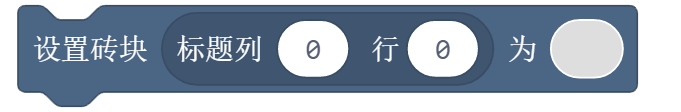

例子：

绘制台阶砖块，找到坐标（5，6）的台阶，把颜色替换成紫色。

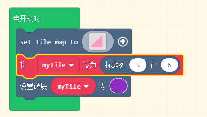

5. 定位相同颜色的砖块，放到一个数组里。通常和替换积木块一起使用，用于批量替换一些砖块。

例子：

绘制台阶砖块，找到所有粉色的台阶，依次替换成紫色。

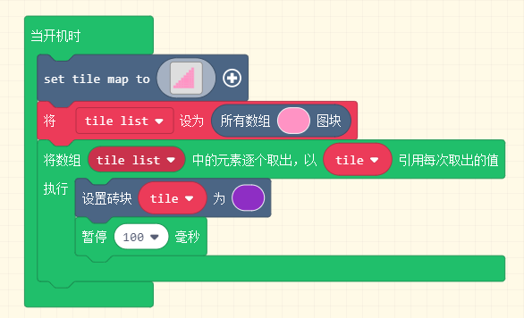

6. 可以将精灵准确的放置在砖块地图上的随机一个砖块位置上，通过颜色索引值去限制精灵所能匹配的砖块颜色类型。

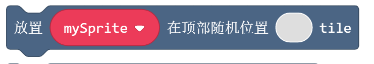

例子：
绘制砖块地图，把精灵随机放在红色砖块上面。

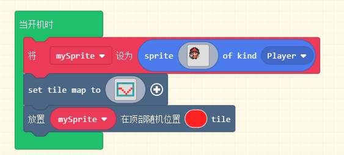

7. 把精灵放在指定的一个砖块上。比如精灵的运动，可以用这个来实现。

例子：

绘制砖块地图，让精灵从左边的砖块依次往右边移动。

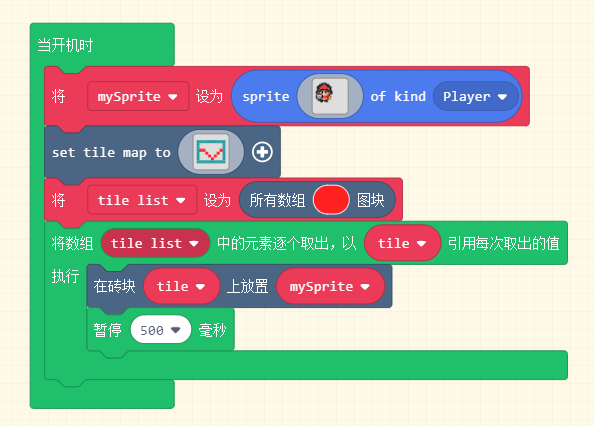

碰撞
-----

1. 当精灵撞到砖块的之后，执行内部程序。

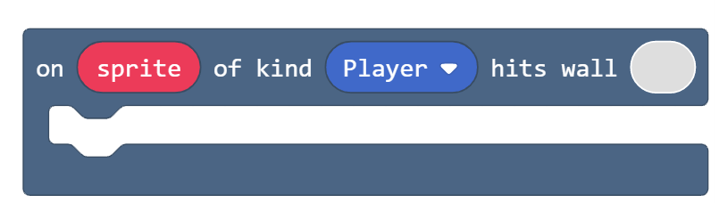

例子：

游戏开始，精灵有10点生命值。用按键开移动精灵，每次撞到墙精灵生命值都回-1，直到生命值为0，游戏结束。

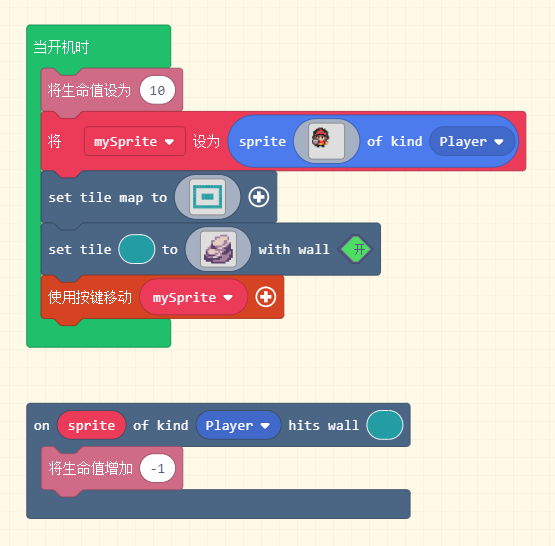

2. 碰到砖块指定方位的时候，返回值是True, 通常和判断条件一起使用，满足条件，执行内部程序。

例子：

绘制砖块地图，用按键移动精灵，撞到墙之后，说出撞的方向。

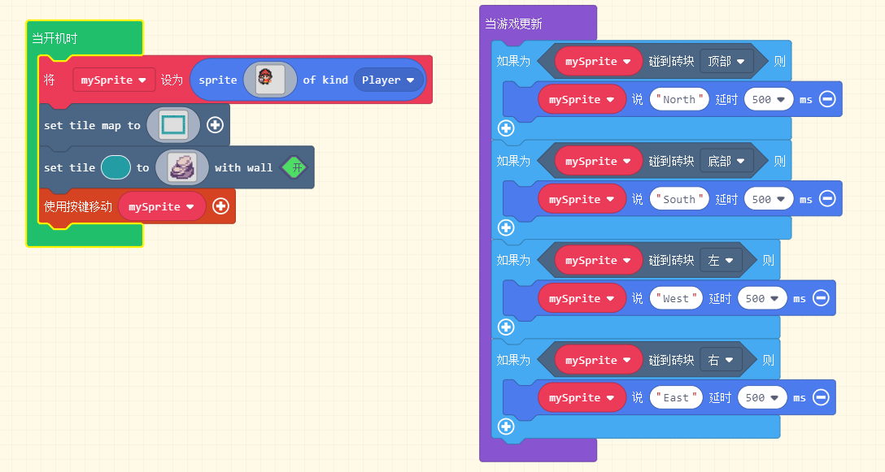

3. 碰到砖块指定方位的时候，返回该砖块的索引值。不同的砖块的索引值是不同的。

例子：

修改一下上面的程序，在精灵碰到砖块后，说出返回的索引值。

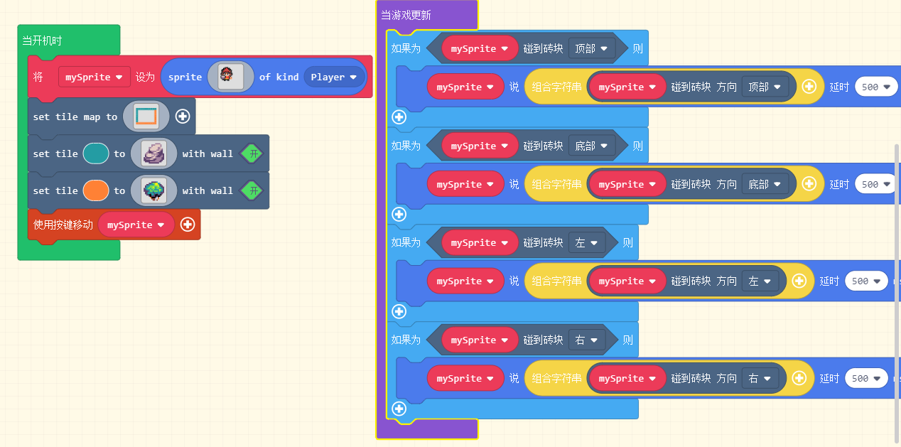

相机
-----

1. 镜头抖动积木块，该积木块属于特效积木块，在遇到危险或发生碰撞事件时以震动来增强游戏效果。

例子：

创建精灵和砖块地图，使用按键来移动精灵，如果精灵撞到砖块顶部，镜头抖动。

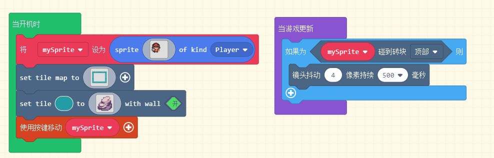

2. 镜头跟随精灵移动。我们的游戏场景通常是比较大的，在精灵移动的过程中，我们希望镜头是跟着精灵走的，这个积木块就能实现这样的效果。

例子：

创建精灵和砖块地图，这里我们使用16*16或者更大的画布，这样我们对应的场景大小就是256*256了，我们的屏幕显示的是场景的1/4， 如果想看到其余的场景，我们可以使用按键来移动精灵，这样镜头就跟着精灵移动，其余的场景在移动的过程中就能展现出来了。

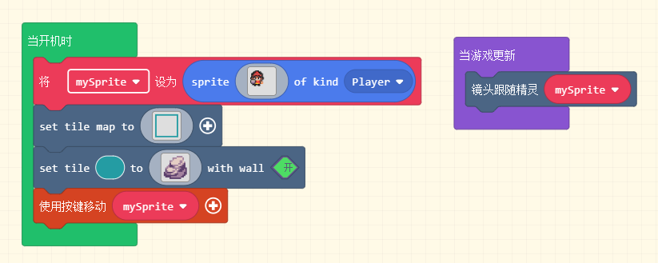

3. 设置镜头的位置， 可以给定一个坐标，然后把镜头转向那个位置。

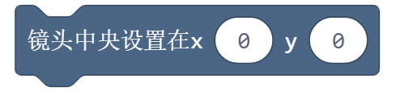

例子：

在上一个例子的基础上，我们把镜头跟随精灵移动变成镜头转向一个随机的坐标。这里，每隔500ms，镜头会转向一同的坐标位置。

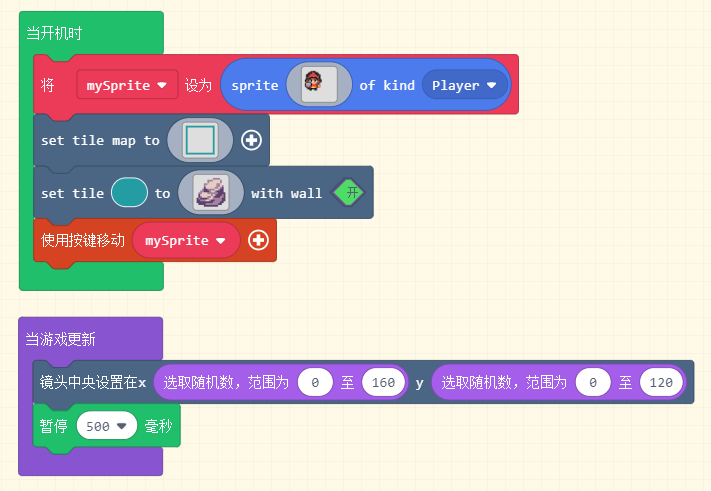
