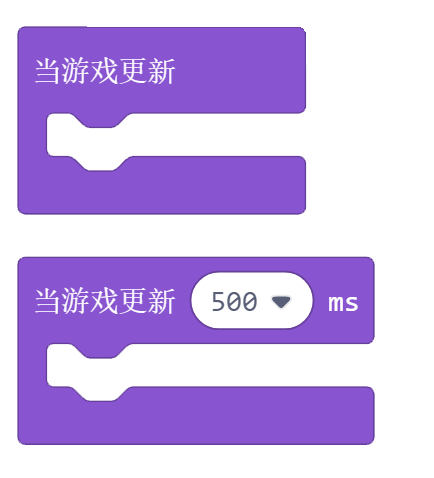

游戏
======

游戏内容
------------

1. 游戏更新积木块，这两个积木块的区别是一个几乎是一直在更新，更新频率由游戏引擎决定。另一个的更新频率取决于后面设置的时间，可以当一个定时器来使用。
   在Arcade游戏编程中，我们用这两个积木块来代替Makecode的【无限循环】。

2. 游戏结束，点击后面的加号可以选择是Win还是Lose.

3. 从游戏开始的时候计时，返回一个游戏运行的时间值，单位是ms.

4. 游戏复位积木块, 让游戏重新开始。

例子：

创建一个玩家，一个食物，使用按键移动玩家。

游戏规则：

    1. 游戏开始后，玩家实时播报游戏开始时间
    2. 玩家吃到食物后，生命值+1
    3. 时间每过2s, 玩家生命值-1
    4. 玩家生命值为0，游戏结束
    5. 按下按键A后， 游戏复位
        

提示（询问)
---------------

* 显示积木块：内容显示在屏幕中间。点击" + "号,可以扩展一个文本框，第一个显示在第一行，第二个显示在第二行。
* 判断提问积木块：文本框中是提问的内容，显示在屏幕中间。点击A是ok, 返回True,点击B是cancel,返回false. 
* 提问字符：返回回答的字符串，用来回来一些文本问题。文本框内是提问的内容，显示在屏幕的上方，问题下方是26个字母以及数字0-9。方向键可以移动选择，A键确定，B键删除，屏幕左下角可以切换大小写。回答完毕之后，用方向键把光标移动到"OK"按钮，点击A键之后，会返回你所回答的字符串。
* 提问数字：返回回答的数字值，这个用来回答一些数字。文本框内是提问的内容，显示在屏幕的上方，问题下方是0-9的数字以及"-"和"."两个符号。方向键可以选择数字，A键确定，B键删除。回答完毕之后，用方向键把光标移动到"OK"按钮，点击A键之后，会返回你所回答的数字值。

例子1：

这是Mike的Xtron, 现在要求玩家输入姓名，如果姓名是Mike, 显示welcome;如果不是mike,显示Input wrong.

.. image:: images/game_example2.png 

例子2： 

提问是100以内的随机整数加法，要求玩家回答。把玩家的回答和正确答案相比较，相同显示回答正确，否则显示回答错误，并且下面一行显示正确答案。

对话框
-----------

* 显示长文本：显示对话框的内容，显示在屏幕中的位置可以选择。支持显示汉字，底部可现实46个字符即23个汉字。
* 设置文本颜色：设置对话框文本的颜色，16个颜色可选。
* 设置对话框样式：可以自己设计对话框的款式，也可以用资料库中的款式。
* 设置对话框光标：光标的图案可以自己设计或者使用资料库的图案。

Tips: 一般来说，我们先把对话框的样式以及颜色选定好之后，再显示对话框内容。如果先显示内容，后面修改颜色等不会应用到之前的文本框。

例子： 

设计一个文本框。

