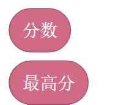
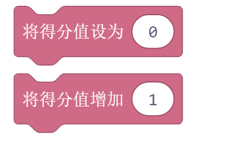
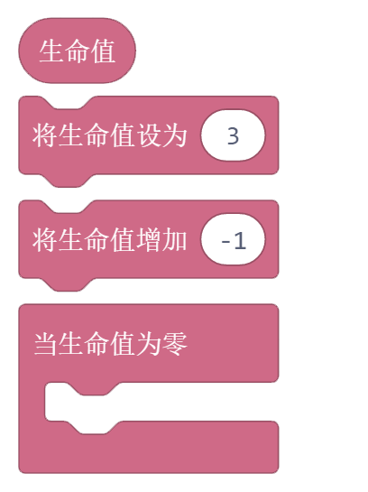
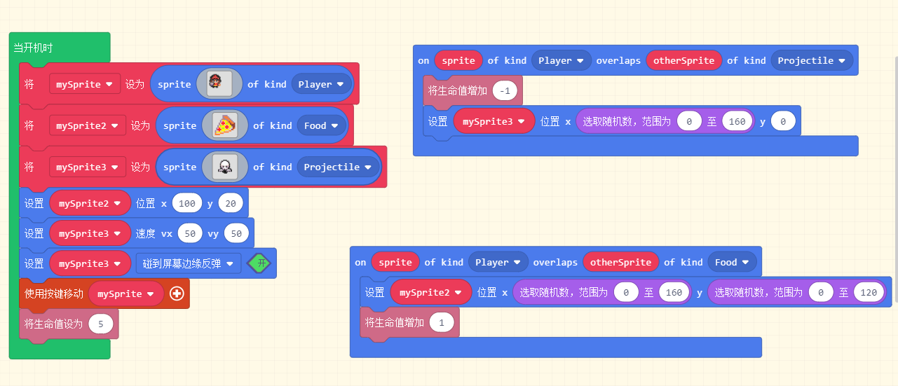
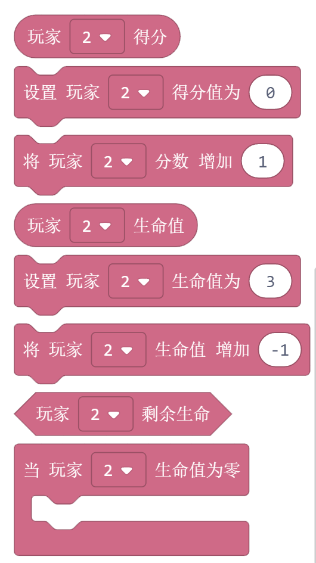
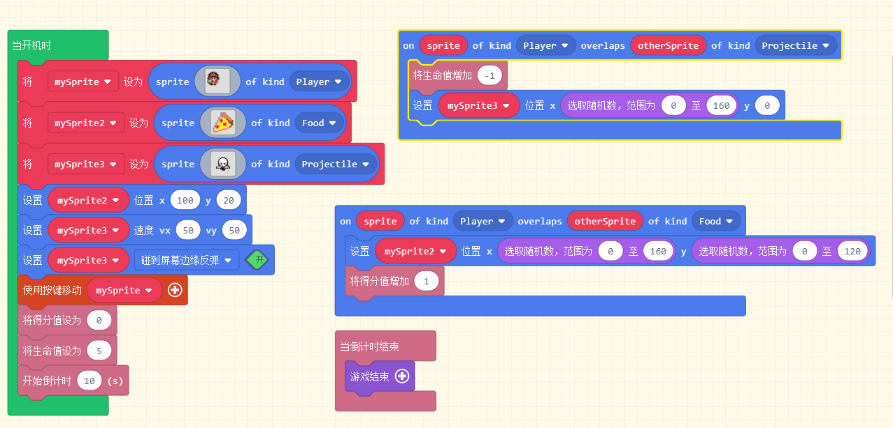

游戏信息
========

得分
------

1. 返回游戏的分数和最高分。

2. 设置和改变游戏的的得分，得分会显示在屏幕的右上角。

生命值
------

* 生命值积木块：返回当前的生命值
* 设置生命值积木块：给玩家赋予一个初始生命值，显示在屏幕的左上角，用爱心数量表示。
* 改变生命值积木块：当玩家完成某一个指令时，给它增加或者减少生命值。数值>0是增加，<0是减少。
* 当生命值为0积木块：当玩家生命值为0， 执行内部指令。

例子：

创建一个玩家，一个食物，一个弹射物。初始生命值是5，当玩家吃到食物的时候，生命值+1， 当玩家碰到弹射物的时候，生命值-1， 当生命值是0的时候，游戏结束。

倒数
------

* 开始倒计时积木块：游戏开始倒计时，倒计时显示在屏幕的上方。只有倒计时作为判断游戏是否结束的时候，倒计时结束，默认是游戏结束。
* 停止倒计时积木块：让当前的倒计时暂停。
* 当倒计时结束积木块：当有生命值等多个条件判断的时候，倒计时结束了游戏依然继续，这个时候如果想要倒计时为0的时候结束游戏，就可以在这个积木块内部执行游戏结束程序块。

例子：

创建一个玩家，一个食物，一个弹射物。玩家初始生命值是5， 倒计时是20s.
游戏规则是：1. 玩家吃到食物，得分+1；
           2. 玩家撞到弹射物：生命值-1；
           3. 当生命值为0或者倒计时结束的时候，游戏结束。

多人游戏
---------

积木块和上面的使用方法是一样的，区别是要对应不同的玩家。

