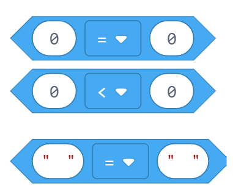
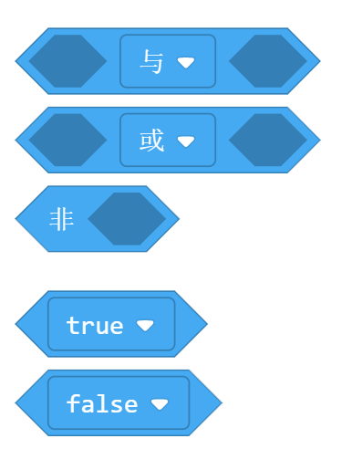

逻辑
======

条件
-------

如果条件为真，执行某些指令，否则执行另外一些指令。

比较
-------

如果前后两个值满足中间的条件（相等，不等，大于，小于等），则返回True. 

布尔值
-------

* 与：如果两个输入都为true, 则返回true
* 或：如果至少一个输入为true, 则返回true
* 非：如果输入为false, 则返回true, 如果输入是true, 则返回false. 