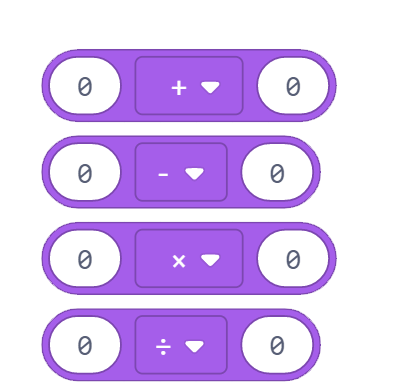
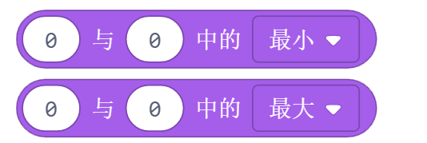
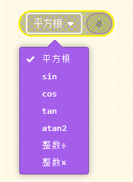
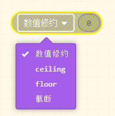

数学
======

1. 加 减 乘 除，返回两个数加减乘除之后的结果

2. 取余，返回两个数相除的余数

3. 比较两个值的大小，返回两个值中的较大值或者较小值

4. 取绝对值，返回数字的绝对值

5. 平方根，三角函数

6. 数值修约

7. 选取随机数，返回一个介于最小值（包含最小值）和最大值（包含最大值）之间的伪随机数。如果两个数字都是整型，则结果也是整型。

8. 约束一个数字在一个范围内。

.. image:: images/math8.png
   :width: 253.5

9. 将数字从一个范围映射到另一个范围，即“自低”值会映射到“至低”值，“自高”值会映射到“至高”值，以前范围内的值会映射到新的范围。

