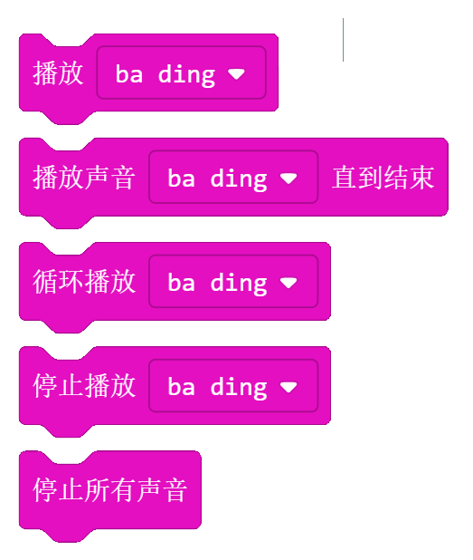
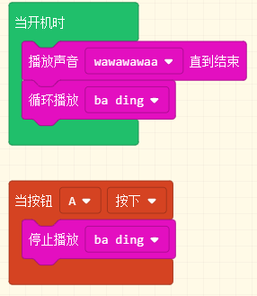
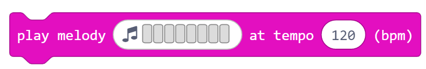
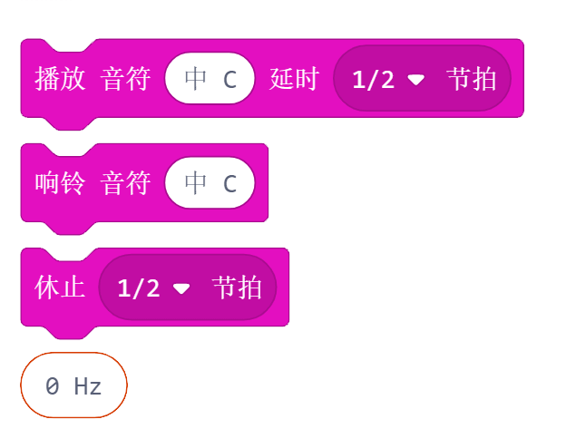
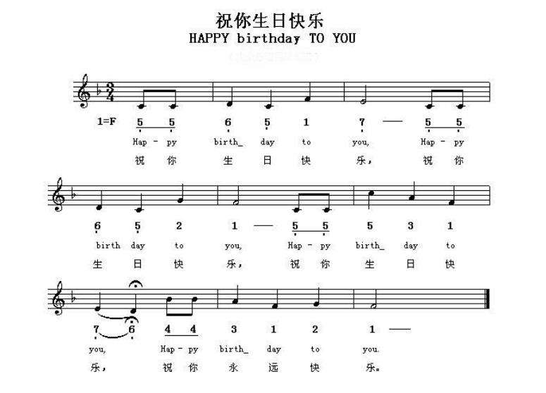
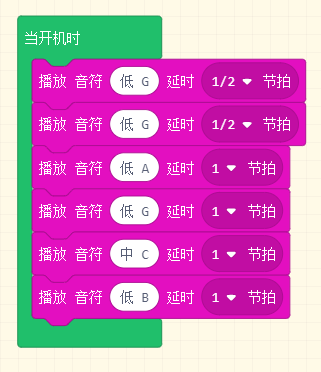
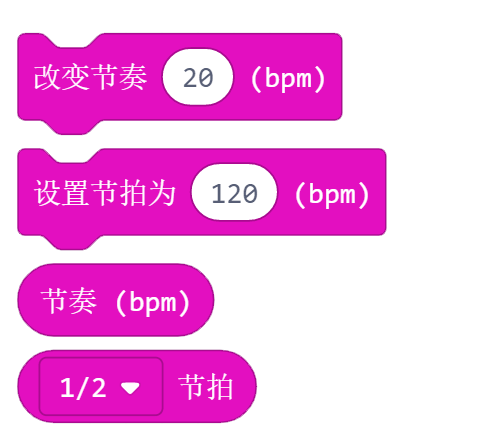
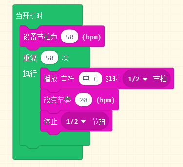

音乐
=====

声音
-----

播放声音以及停止播放。下拉框里面的音乐可选。

* 播放声音：播放所选声音，如果后面播放了新的声音，会一起播放。
* 播放声音直到结束：播放所选声音，直到播放完毕才会开始播放下一个声音。
* 循环播放：所选声音会循环播放，直到停止播放。
* 停止播放：停止播放所选声音。
* 停止所有声音：所有的之前播放的声音都被停止。

例子：

播放声音wawawawaa, 结束后循环播放 ba ding, 直到按键A按下，停止播放。

Melody
-------

播放一段旋律，其中旋律可以自己编辑或者选用已有的。tempo是播放旋律的节奏，范围是0-500，值越大，节奏越快。

例子：

播放一段哆来咪发唆拉西哆的声音。

音调
-----

* 播放音符积木块，可以选择音符和拍数播放，提供的八度音符支持3个八度，分别为低中高。
* 响铃积木块，会不停的播放所选音符。
* 休止积木块，可以当作休止符来用，节拍长度可选。
* 另外可通过第4个积木块来播放跨度更高的音调，这里有将近8个八度的完整蜂鸣器频率，只要输入对应音符的频率。

例子：

可以按照下面的谱子来编写一首生日快乐歌。

下面是第一个小段的音乐：

音量
-----

设置音量大小，一般在播放音乐前后使用。

.. image:: images/music4.png
   :width: 138

节拍
-----

BPM是Beat Per Minute的简称，表示每分钟的拍数。

* 改变节奏：改变播放声音的节奏。>0是加快节奏， <0是减慢节奏。
* 设置节拍：设置声音的节拍的快慢。数值越大，节奏越快。
* 节奏： 返回当前的节奏值。
* 节拍： 节拍值，下拉框可选，可以在设置节拍的时候使用。

例子：

播放一段节拍越来越快的旋律， 如果想要节拍越来越慢，改变节奏的值设为<0即可。

