精灵
========

创建精灵
----------

用于创建游戏中的角色，其中精灵的造型可以选择角色库中的形象，也可以自己绘制。类型可以根据需要来设置，也可以添加新的类型。

例子：

创建一个柠檬作为游戏中的角色，可以看到模拟器中也出现了创建的角色。

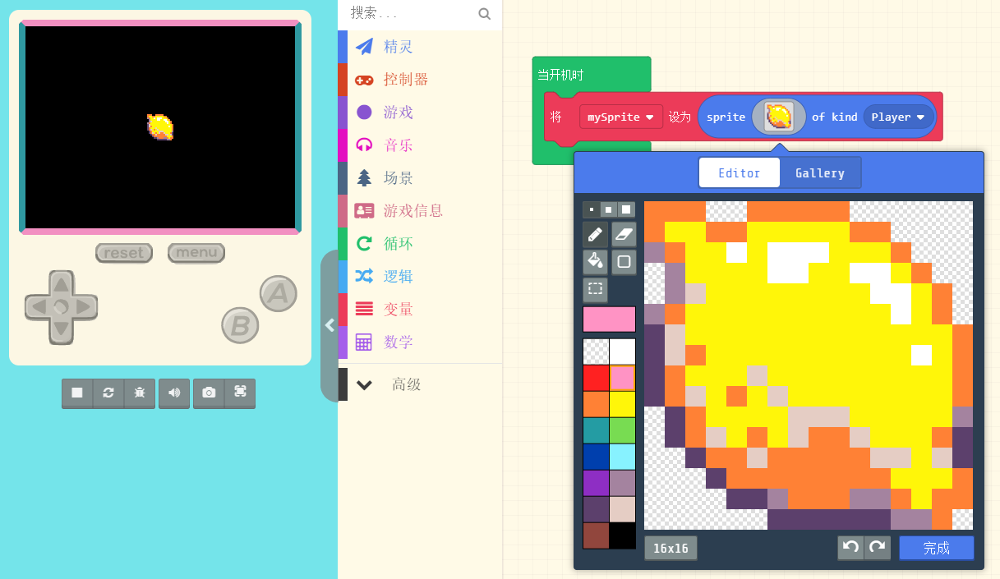

物理
------

1. 设置精灵的基本物理属性：位置，速度

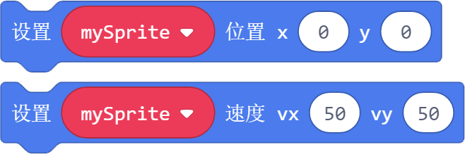

例子：

创建一个角色，让它初始坐标是（30，10），并且按照X轴速度50，Y轴速度50运动。

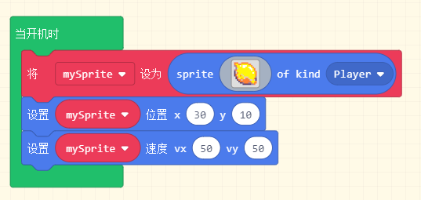

2. 精灵属性的取值，改变精灵属性的值，设置精灵属性的值。

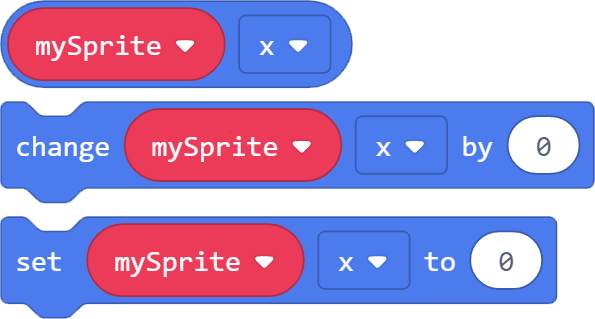

属性值选择框下拉，除了基本的x，y坐标，有下面这些可选属性：

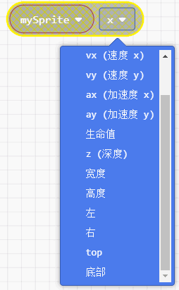

* vx、vy：表示x轴，y轴的速度
* ax、ay：表示x轴，y轴的加速度
* 生命值：表示精灵存在的时间，生命值的单位是s
* z(深度)：表示精灵的前后位置关系，数值越大表示精灵越靠前
* 宽度高度：表示精灵像素的大小
* 左、右、top、底部：分别表示精灵距离这四个方向的像素值(其中左上角的像素值是（0,0）)

例子：

创建一个角色，让它以速度15往下运动， 当按下按键A后，把加速度改变成向上的10，角色开始向上运动。

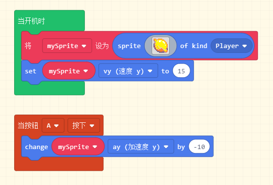

3. 让一个角色跟随另一个角色变化位置

例子：

创建一个柠檬角色，一个草莓角色，让草莓跟随柠檬移动。我们给柠檬设置一个移动速度，虽然我们没有给草莓设置速度，但是它会跟着柠檬一起运动。

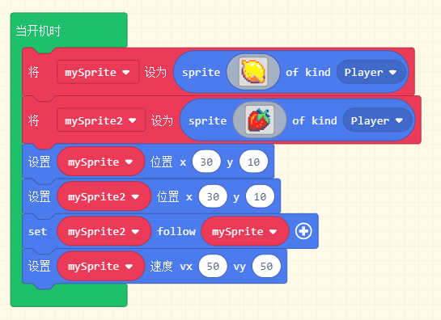

特效
-------
1. 给精灵开启特效和消除特效

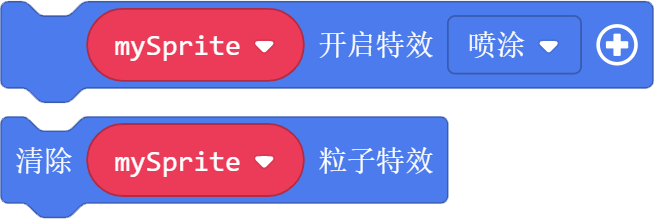

例子：

创建一个精灵，开启喷涂特效，按下按键A之后，消除特效。

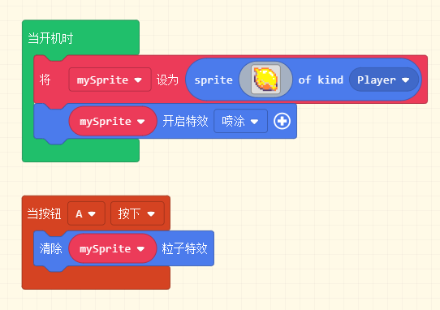

2. 把创建的精灵从游戏中销毁

例子：

创建一个精灵，开启喷涂特效，按下按键A之后，销毁精灵。

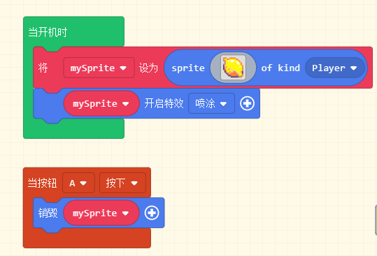

3. 让精灵说话，在精灵上方会出现一个对话框，精灵想说的话会显示出来。

例子：

创建一个精灵，按下按键A之后，精灵说"hello"并且延时1S,1S之后对话框消失。

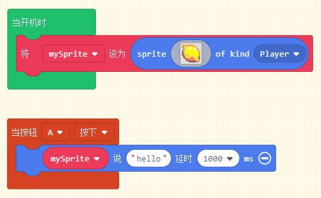

4.设置精灵的一些功能，下拉框是可选的参数。

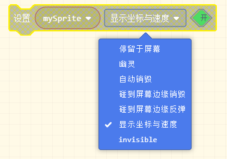

可选的参数分别表示：

停留于屏幕：让精灵只能处于160*128的屏幕内(可以配合跟随积木块一起使用)
幽灵：幽灵模式的精灵无法接触到游戏中的其他场景和角色
自动销毁：变成幽灵的精灵走出屏幕范围后自动销毁
碰到屏幕边缘销毁：精灵碰到屏幕边缘会销毁
碰到屏幕边缘反弹：精灵碰到屏幕边缘反弹
显示坐标与速度：在精灵底部显示他的坐标和速度

例子：

创建一个精灵，给它一个速度移动，碰到屏幕边缘后精灵反弹。

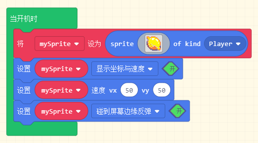

弹射物
--------

给弹射物一个速度，让它从边上弹射出来，或者从精灵周围弹射出来。

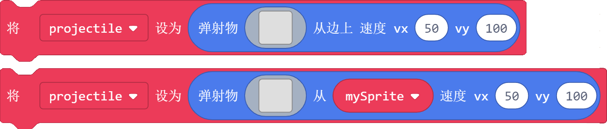

例子：

创建一个树， 雪花从边上慢慢下落，有个苹果从树上掉下来。

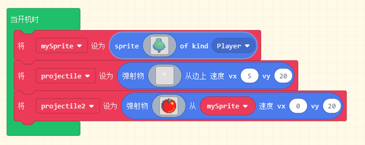

重叠
-------

1. 当两个精灵相互重叠时，执行内部的程序。注意这里的精灵类型也是判断条件之一。

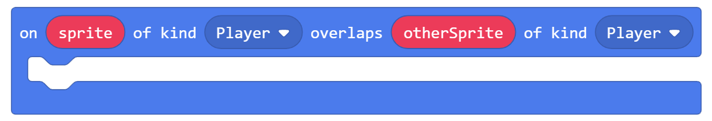

例子：

当两个精灵重叠的时候，得分增加1.

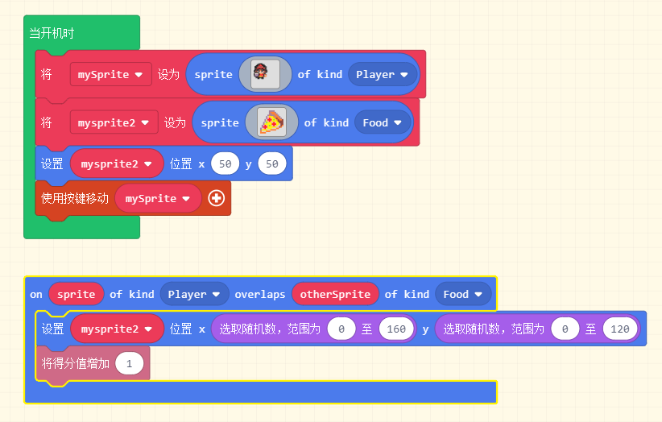

2. 当两个精灵重叠时，返回值是True。作为一个判断条件，常常跟逻辑语句结合使用。

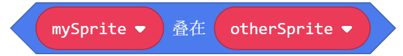

例子：

同上，当两个精灵重叠的时候，得分增加1. 只是用了两种不同的判断方式。

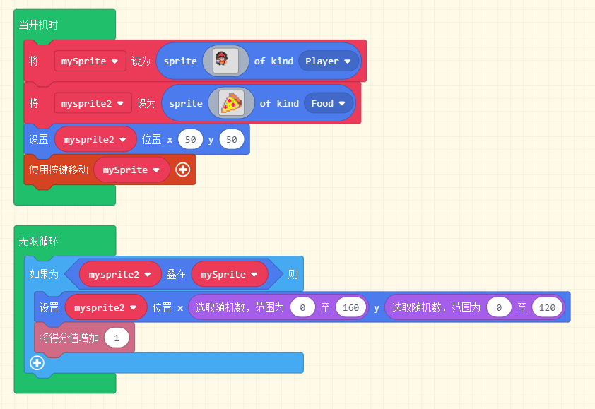

3. 设置精灵的类型， 返回精灵的类型

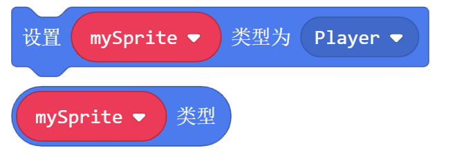

例子：

游戏开始时，当两个精灵重叠的时候，得分不变，但是按下按键A后，两个精灵重叠的时候，得分增加1. 因为在按键A按下的时候，我们把mysprite2的类型改成了Food, 我们的判断条件里，要求Player类型和Food类型精灵重叠时，得分才增加1.

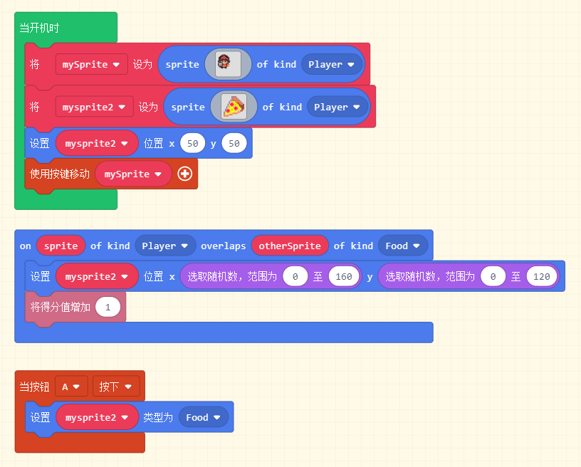

生命周期
----------

当一个精灵被创建或者被销毁的时候，执行内部程序。

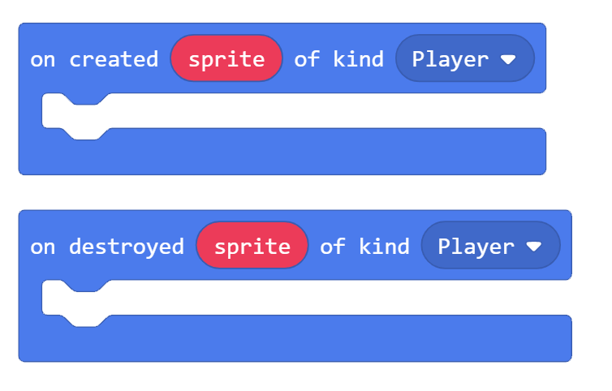

例子:

游戏开始时创建一个玩家，按下按键A时，创建一个柠檬角色，类型是食物，并且玩家说“food created”. 按下按键B时，销毁柠檬角色，并且玩家说“food destoryed”.
这里我们还创建了一个flag变量，因为如果食物没有被销毁，我们是不能重复创建同一个食物精灵的。所以只有在食物被销毁后，flag=0, 按下按键A, 才会创建食物。

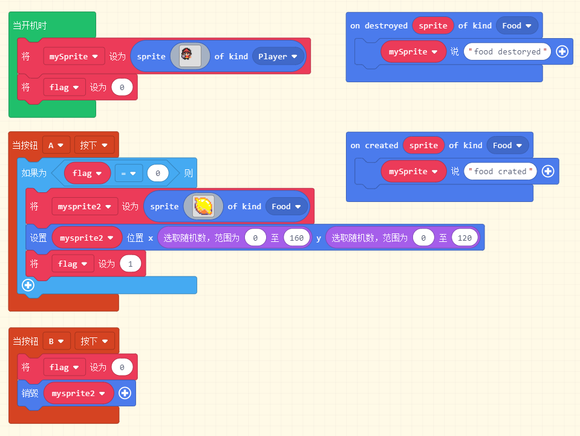

图像
-----

为精灵设置新的形象，也可以将一个精灵的形象设置成另一个精灵的形象。

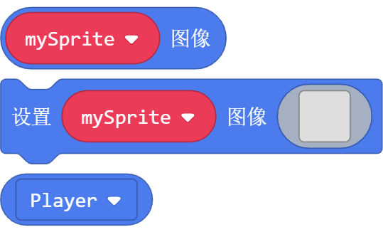

例子:

创建一个玩家精灵， 创建一个食物精灵。当按键A按下，玩家精灵变成食物形象，当按键B按下，回复到玩家形象。

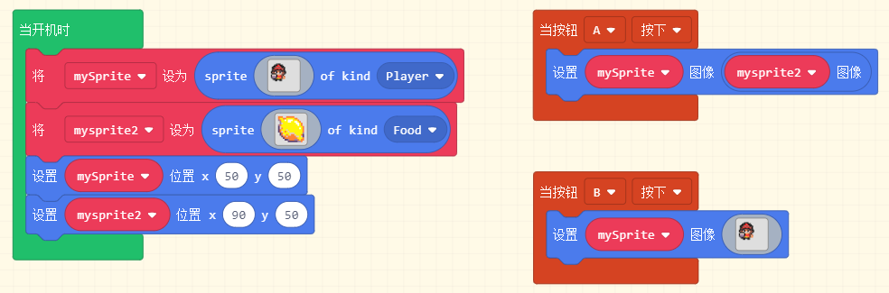