吃披萨的小人
=============

游戏介绍
----------
您将创建一个游戏，游戏中有两个精灵，一个玩家精灵和一个食物精灵。

游戏规则：

    1. 每次你的玩家抓到比萨饼，得分会+1，并且重新开始倒计时。
    2. 倒计时为0游戏就结束，所以玩家要尽可能的多吃披萨饼，看谁在游戏结束前得分最高。

游戏教程
---------

1. 选择【场景】->【设置背景颜色】积木块，给游戏背景设置一个颜色，可以选择自己喜欢的颜色。

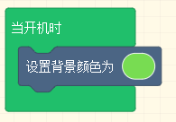

2. 选择【精灵】->【将精灵设为。。。】积木块，来创建一个玩家精灵。玩家精灵的形象可以自己绘制，也可以使用资料库中的图案。

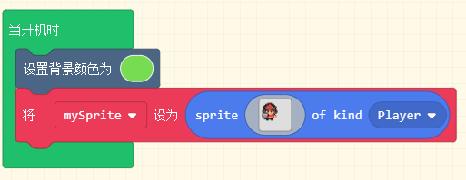

3. 选择【控制器】->【使用按键移动精灵】积木块，来用按键移动你的玩家。

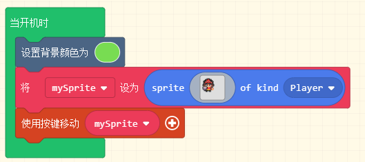

4. 选择【精灵】->【将精灵设为。。。】积木块，来创建一个食物精灵。这里我们使用资料库中的pizza形象，你也可以自己绘制。点击最前面的变量下拉框，把变量的名字重命名为"pizza".

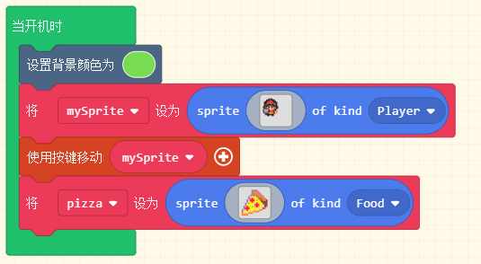

5. 选择【精灵】->【设置精灵位置】积木块。一开始的时候，两个精灵重叠在一起，我们把披萨精灵放在别的位置，让它和玩家不重叠，坐标可以自己设置。

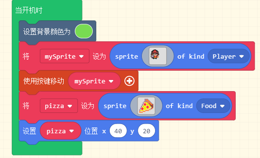

6. 选择【精灵】->【当精灵重叠】积木块。我们的游戏规则是玩家抓到披萨饼，得分＋1，当玩家精灵和食物精灵重叠时，我们认为玩家抓到了披萨。把积木块中的精灵类型，一个设置成玩家类型，另一个设置成食物类型。

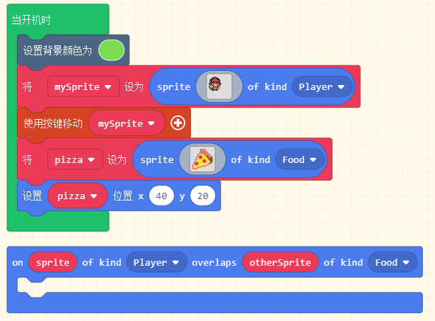

7. 选择【游戏信息】->【将得分值增加】积木块，当两个精灵重叠时，得分＋1.

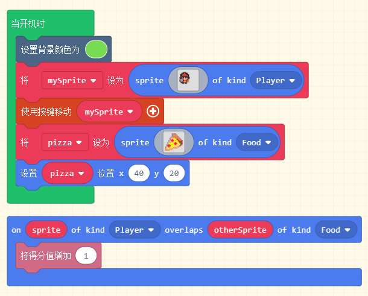

8. 选择【精灵】->【设置精灵位置】积木块，精灵重叠之后，我们发现只要精灵不分开，得分会一直增加。我们希望看到的是玩家每吃到一次披萨，得分只增加1，所以这里我们在精灵重叠之后，把披萨放到屏幕的其他位置。

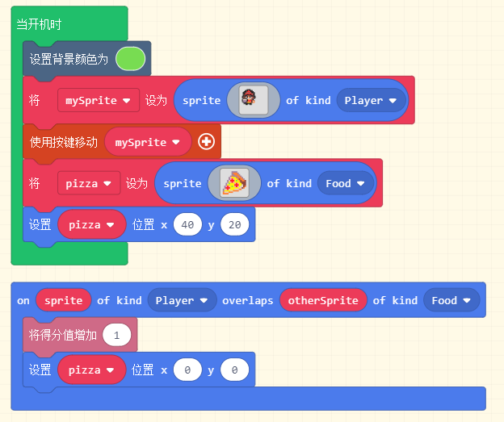

9. 选择【数学】->【选取随机数】积木块。在刚才的设置精灵位置积木块,为了让游戏更加好玩，我们想要披萨每次都出现在屏幕的不同位置。
   因为Arcade游戏屏幕大小是160*120，所以我们把披萨的位置设为X取0-160的随机数， Y设为取0-120的随机数。 

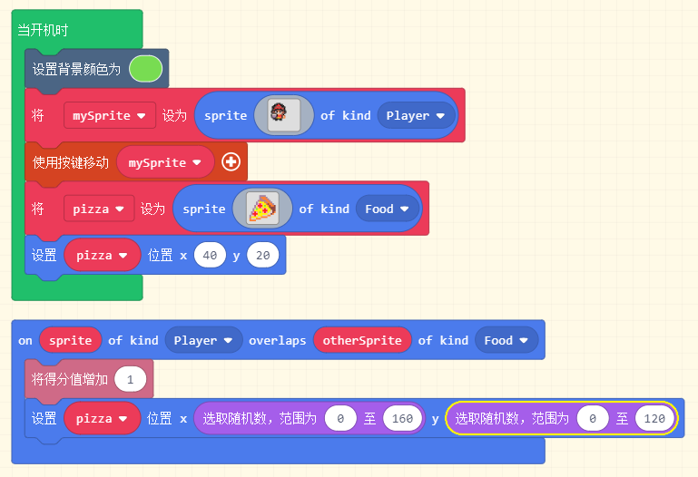

10. 选择【游戏信息】->【开始倒计时】积木块。当游戏开始时，倒计时开始。在玩家吃到披萨后，得分+1,披萨移动到随机位置，重新开始倒计时。
    这里我们在开机时以及玩家吃到披萨时都要加上倒计时，前者是初始化，后者是根据规则重新开始倒计时。倒计时的时间你可以根据自己想要的游戏难度来设置。

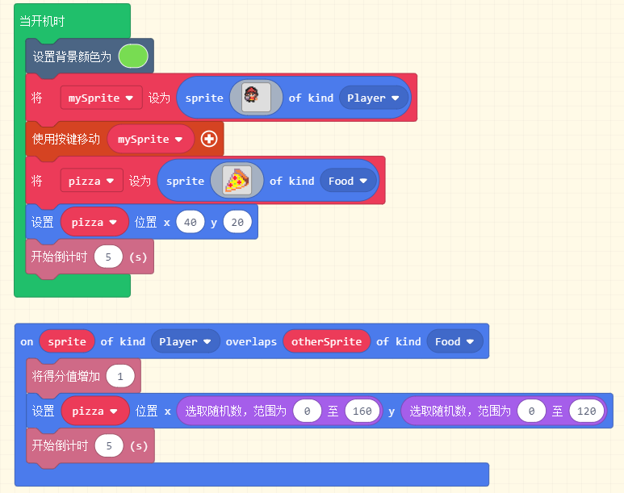

11. 到这里这个游戏就已经完成了，你可以先用Arcade的模拟器感受一下，然后点击【下载】，把游戏下载到你的Xtron上，体验一下你自己编写的游戏。
    如果你有一些新的游戏规则想要实现，可以尽情的创作！

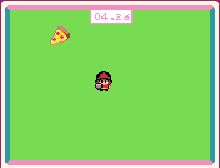

参考程序：https://makecode.com/_Ky0agk82cJU2