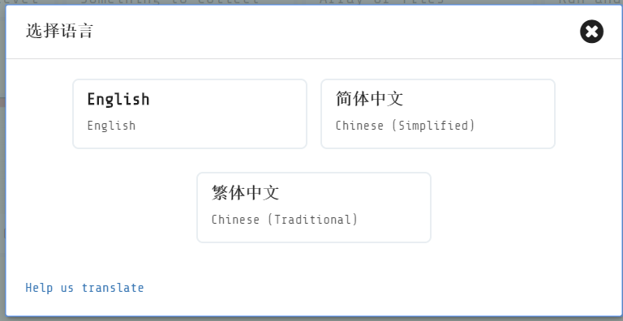
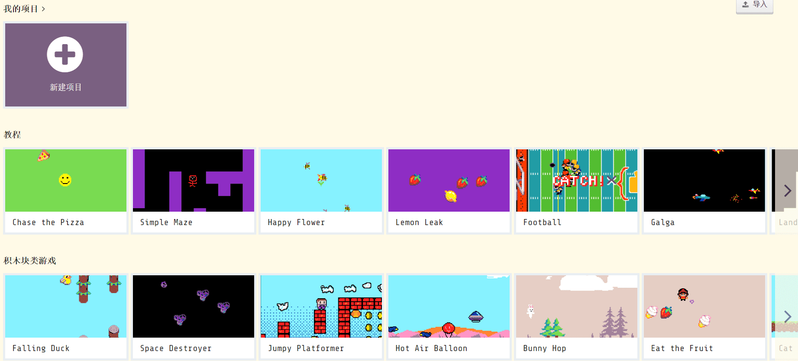
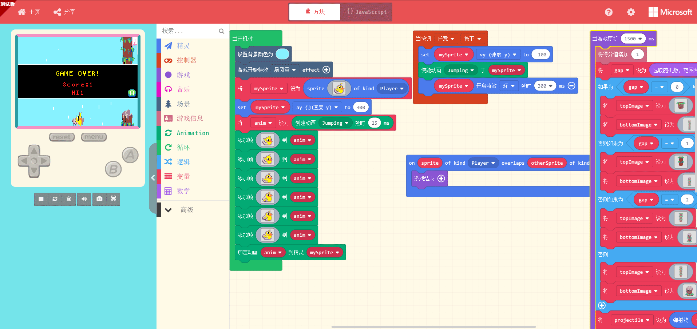

入门Arcade
======================

Arcade介绍
----------------

Makecode Arcade平台主打游戏编程，你可以用简单的积木块来搭建自己的游戏，积木块的功能可以参考下面的 Arcade及积木栏详解：https://ovobot-docs.readthedocs.io/zh_CN/latest/Xtron/Xtron_Arcade/Xtron_Arcade_Block_Introduction/index.html

平台左侧是一个模拟器，你编写的游戏实时效果会在模拟器上展示，你可以实时的调试和优化自己的游戏。

平台支持积木块转JS代码，在Arcade平台上，你可以通过积木块编程入门，再进阶到JS编程，逐渐锻炼你的逻辑思维以及增进你的编程技巧。

Makecode平台编程地址: https://arcade.makecode.com

快速入门
----------

在开始编程之前，我们先介绍一下Xtron的使用方法。

1. 我们首先体验一个经典游戏Falling Duck。

  打开编程网址首页，如果你是第一次使用Arcade，显示的是默认的英文，你可以滚动到页面的最下方，点击语言，切换成你想要的语言。

  滚动鼠标，找到【积木块类游戏】并点击进入。

  这里，你会看到这个游戏对应的积木块的代码，点击切换成{}JavaScript，你可以看到对应的JS代码。
  在左边的模拟器上，你可以先体验一下游戏的效果。点击任意按键开始游戏，每次按键按下之后，duck会往上跳动一次，顺利穿过一个树桩得分+1。

2. 接下来我们把项目下载到Xtron来体验一下。
   点击左下角的【下载】按键，

3. 下面我们新建一个项目。

4. 平台支持积木块和JS两种语言，可以相互转换。

5. 分享项目。