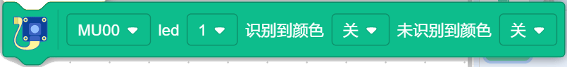

视觉识别摄像头积木块编程指南
===============================

实时调试的时候MU跑完一次要复位

视觉识别
---------

初始化端口程序块
""""""""""""""""""

恢复默认设置程序块
""""""""""""""""""

.. image:: images/restore_the_default.png
   :width: 184

算法检测程序块
""""""""""""""""""

判断摄像头检测程序块
""""""""""""""""""""""

.. image:: images/camera_detection.png
   :width: 250

检测到颜色识别程序块
""""""""""""""""""""""

检测到色块颜色程序块
""""""""""""""""""""""

.. image:: images/patch_testing.png
   :width: 291.5

获取算法程序块
"""""""""""""""

获取颜色识别程序块
"""""""""""""""""""

获得算法形状卡片程序块
"""""""""""""""""""""""

.. image:: images/get_shape_card.png
   :width: 286

获得算法交通卡片程序块
""""""""""""""""""""""

获得算法数字卡片程序块
""""""""""""""""""""""

获得算法颜色识别程序块
""""""""""""""""""""""

.. image:: images/color_identification.png
   :width: 312

LED识别颜色程序块
""""""""""""""""""

设置算法性能程序块
""""""""""""""""""

数码变焦程序块
"""""""""""""""

.. image:: images/digital_zoom.png
   :width: 219

摄像头白平衡程序块
""""""""""""""""""

高帧率模式程序块
""""""""""""""""""

