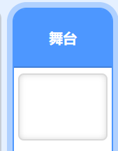
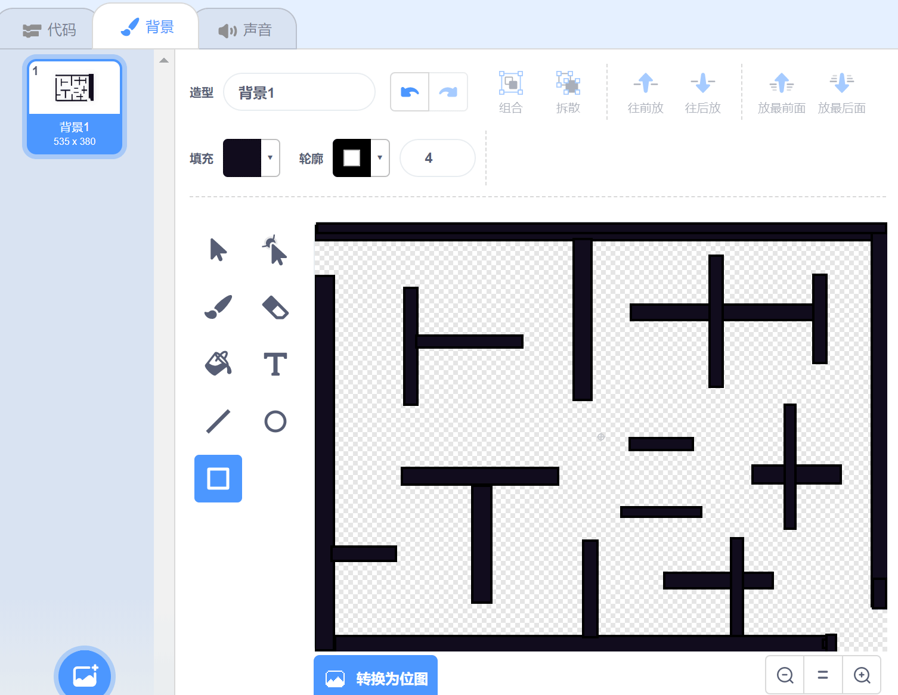

第一课 走迷宫
==============

今日任务:  
""""""""""""

今天我们将利用Scratch制作一个迷宫游戏，通过Xtron的上，下，左，右按键来移动人物，如果人物碰到迷宫墙壁则游戏失败。同时，如果碰到游戏中的巡逻兵也会失败。

任务拆解：
""""""""""""

（1）利用什么工具绘制迷宫？

（2）人物如何接收键盘指令？

（3）如何判断碰到迷宫墙壁会失败？

（4）如何判定游戏胜利？

（5）如何让巡逻兵角色进行巡逻？

（6）如何判断碰到巡逻兵失败？

动手操作：
""""""""""""

第一步：点选右下角舞台，选择背景。

用矩形工具绘制如下图形。

第二步：点击选择角色，挑选一个你喜欢的角色。

第三步：我们要实现的效果是小狗可以按照键盘指令移动。如果在移动过程中角色Dog1偏离路线碰到了墙壁则失败，移动到终点则成功！
一开始小狗从“起点开始”，注意下图x：和y：的大小，x和y的数值代表角色1的位置。
一开始默认的大小是100，如果你挑选的角色比较大，那么，修改大小值，使角色可以通过迷宫的一些空隙，
然后注意这个大小值，我们后面初始化的时候需要用到。

.. image:: images/dog1.png
   :width: 300

（1）一开始，我们需要确定角色1出现的位置以及大小，还要设置翻转模式为左右翻转。

（2）然后我们控制角色1移动。

（3）添加一个食物角色，放在出口处。狗狗走出迷宫，吃到食物则游戏胜利。

（4）在移动的过程中，碰到迷宫黑色墙壁则失败，碰到食物则成功，但是无论成功还是失败，小狗都将重新返回到起点。

（5）移动过程中，有的空隙很小，小狗过不去，我们用A按键让小狗变大，B按键让小狗变小。

第四步：添加一个角色Ladybug2作为巡逻兵。

第五步：为Ladybug2添加脚本，让它可以满屏幕移动。

第六步：最终，角色Dog1的完整程序如下：

.. image:: images/Ladybug2_move_example.png
   :width: 550

课后反思： 
""""""""""""

（1）为了增加游戏的趣味性一，可否增加时间限制功能？在规定的时间内没有过关就失败。

（2）为了增加游戏的趣味性二：在游戏中能否增加“传送门”角色？当主角碰到传送门的时候可以被“传送”？

