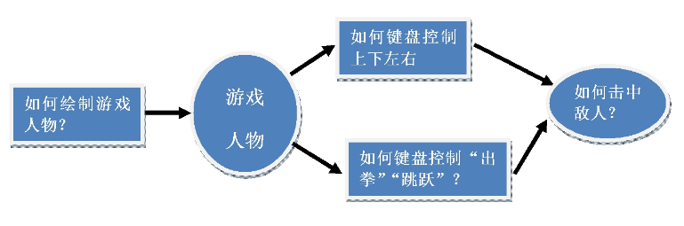
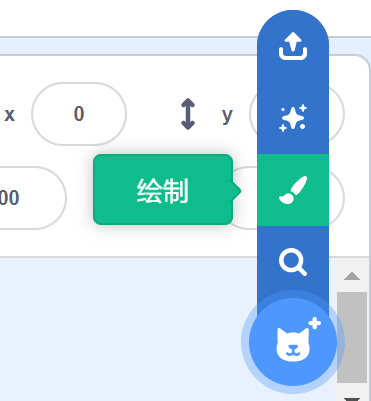
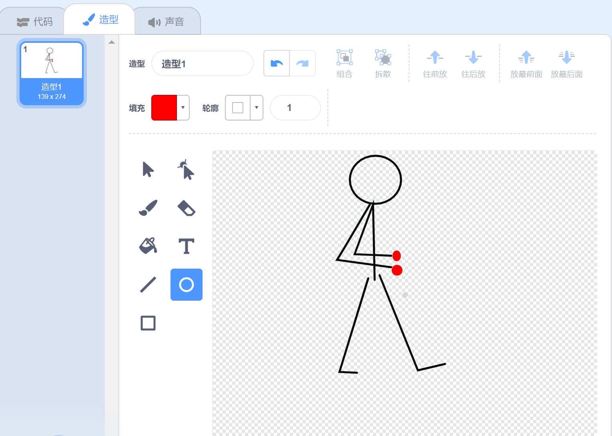
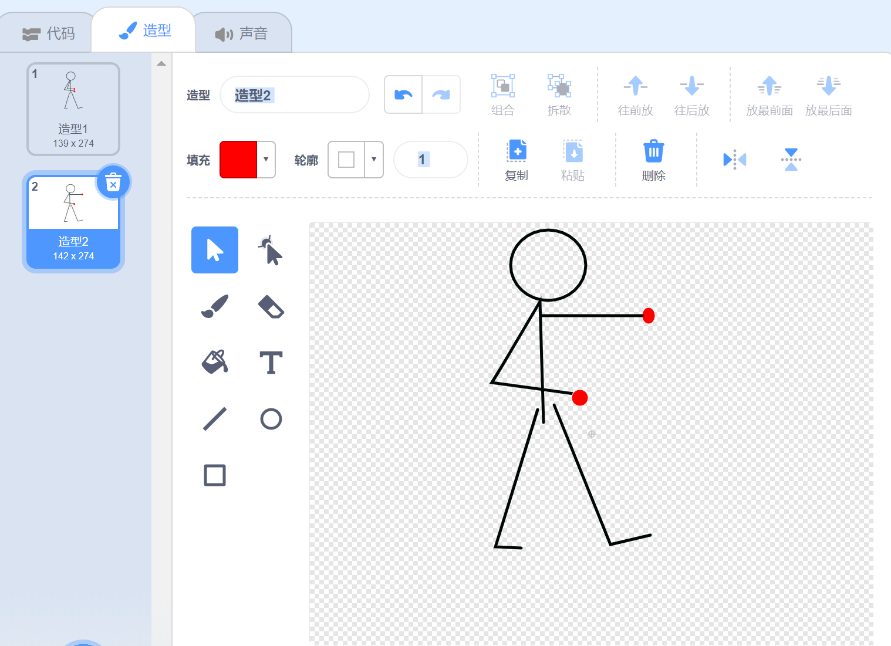
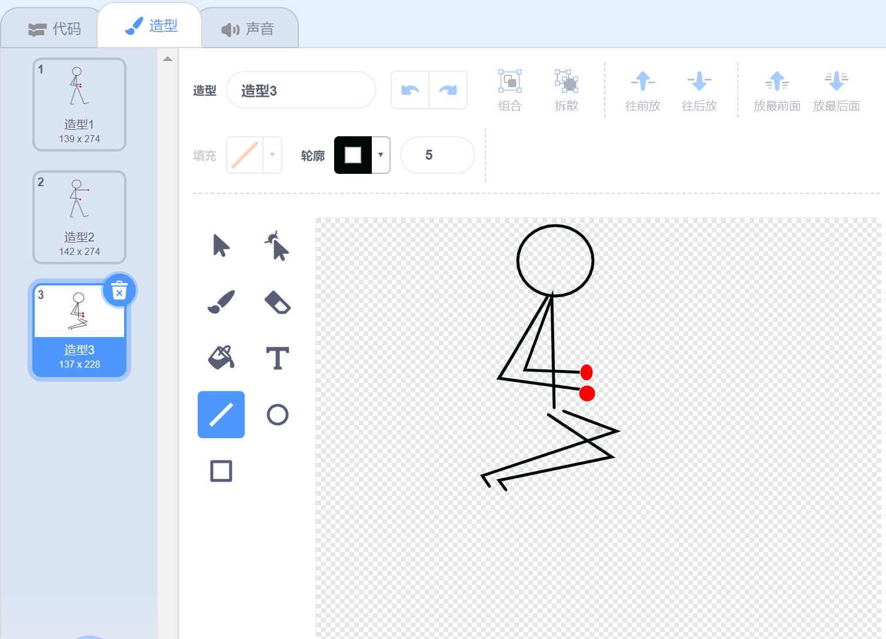
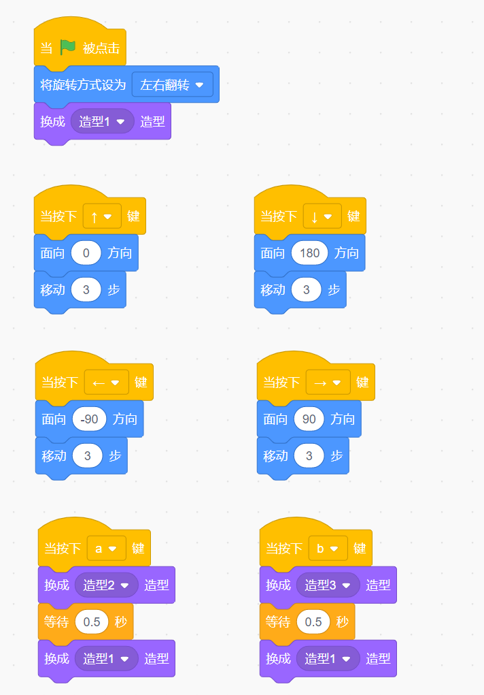
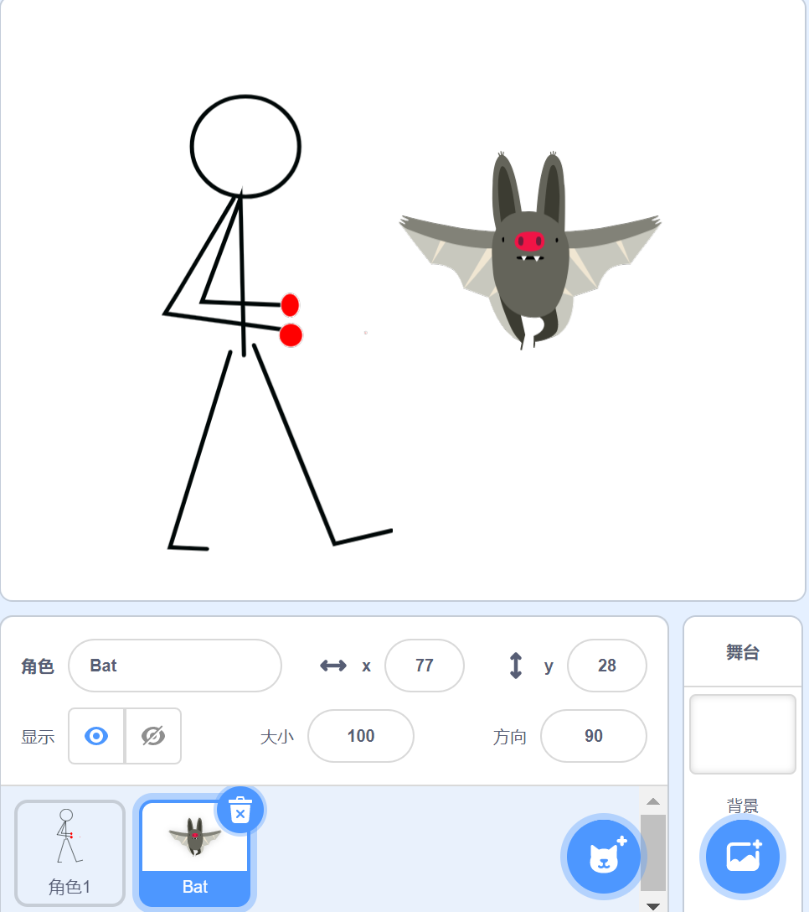
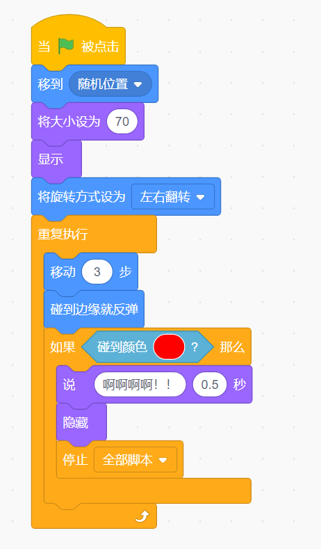
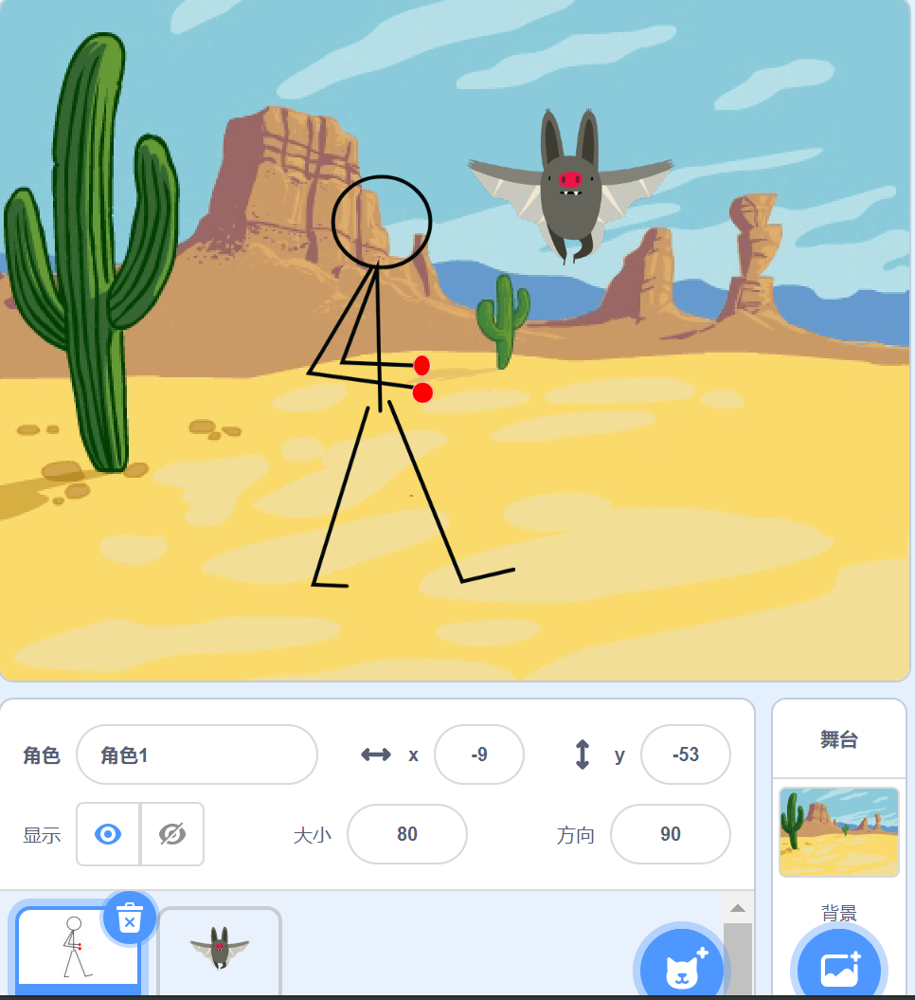

第二课 人物控制
=================

今日任务:  
""""""""""""

今天我们将制作一个游戏人物，这个游戏人物可以由Xtron的上，下，左，右按键来控制移动，还可以用A B按键做出“出拳”，“跳跃”的动作。

任务拆解：
""""""""""""

动手操作：
""""""""""""

第一步：点击角色里的绘制按键，来绘制一个人物角色。

第二步：绘制人物角色。

（1）绘制造型1如下：

（2）造型1绘制结束后，复制造型1，下方出现造型2，我们修改造型2为：

（3）再复制出一个造型3，修改如下：

第三步：我们为人物角色编写程序，按Xtron上，下，左，右按键的时候人物移动（只能左右翻转），按A按键出拳，按B按键跳跃。

第四步：增加另外一个角色，作为我们的角色1的攻击对象，我们选择一个Bat角色。

第五步：为Bat角色编写代码，Bat随意的移动，当碰到人物角色的拳头是，说出“啊！”，然后消失。

程序如下：

第六步：为我们的游戏选择一个好看的背景.

课后反思： 
""""""""""""

（1）请你自行设计“出腿”，“飞踹”等大招。

（2）当游戏人物攻击的时候，有时会出现这样一种情况，明明还没有出拳，但是敌人已经被击中消失了，这是为什么，怎么改进？

