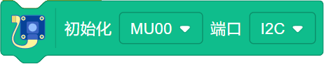

Xtron Scratch 课程
=======================

以下是使用Scratch给Xtron可编程游戏机编程的快速参考，如果你是第一次给Xtron编程，请先阅读接下来的部分：

.. toctree::
   :maxdepth: 1

灯光
-----

设置板载程序块
"""""""""""""""

.. image:: images/set_the_onboard.png
   :width: 176

Xtron板载上有2个LED灯，可以分别设置熄灭和点亮。充电时led1亮红灯，下载代码时led1闪红灯，开机时led2亮蓝灯后熄灭。

板载电平反转程序块
"""""""""""""""""""

.. image:: images/onboard_level_inversion.png
   :width: 141

电平反转即Xtron的led灯从点亮变为熄灭或者从熄灭变为点亮。

设置板载亮度程序块
"""""""""""""""""""

.. image:: images/the_onboard_brightness.png
   :width: 195

设置Xtron板载的led灯的亮度，数值范围为0~255。

设置板载RGB灯颜色程序块
"""""""""""""""""""""""

.. image:: images/onboard_RGB_lights.png
   :width: 202

Xtron板载上有4个RGB灯，可以分别设置不同的颜色，通过颜色、饱和度、亮度来调节颜色，数值范围均为0~100。
还可以从选择的角色中一键吸取已有的颜色。

设置板载RGB所有灯颜色程序块
"""""""""""""""""""""""""""

.. image:: images/onboard_RGB_all_lights.png
   :width: 188.5

也可以将板载上的4个RGB灯，设置为相同的颜色，通过颜色、饱和度、亮度来调节颜色，数值范围均为0~100。
还可以从选择的角色中一键吸取已有的颜色。

设置板载RGB灯亮度程序块
"""""""""""""""""""""""

.. image:: images/brightness_of_onboard_RGB_lamp.png
   :width: 157.5

设置Xtron板载的RGB灯的亮度。

显示
-----

显示清空程序块
""""""""""""""

.. image:: images/according_to_empty.png
   :width: 57

显示清空。

设置屏幕背景色程序块
"""""""""""""""""""""

.. image:: images/rest.png
   :width: 124.5

设置屏幕的背景色，通过颜色、饱和度、亮度来调节颜色，数值范围均为0~100。还可以从选择的角色中一键吸取已有的颜色。

显示生效程序块
"""""""""""""""

.. image:: images/according_to_take_effect.png
   :width: 57

显示生效。

设置画笔颜色程序块
""""""""""""""""""

.. image:: images/brush_color.png
   :width: 113

设置画笔的颜色，通过颜色、饱和度、亮度来调节颜色，数值范围均为0~100。
还可以从选择的角色中一键吸取已有的颜色。

设置文本内容程序块
""""""""""""""""""

.. image:: images/draw_text_content.png
   :width: 222

绘制某个坐标（x，y）的文本内容，文本内容可以是字母、数字、文字。

绘制线长度程序块
""""""""""""""""""

.. image:: images/draw_line_length.png
   :width: 254.5

绘制某个坐标（x，y）的水平线或垂直线，线的长度≤显示屏的长度。

绘制线坐标程序块
""""""""""""""""""

.. image:: images/draw_the_line.png
   :width: 265

绘制从一个坐标（x1，y1）到另一个坐标（x2，y2），两个特定的坐标之间连成一条线。

设置空心矩形程序块
""""""""""""""""""

.. image:: images/draw_a_rectangle.png
   :width: 305

在某个坐标（x，y）绘制空心矩形或实心矩形，通过设置矩形的宽和高来改变矩形的大小。

设置空心圆程序块
""""""""""""""""""

.. image:: images/draw_a_hollow_circle.png
   :width: 254.5

在某个坐标（x，y）绘制空心圆或实心圆，通过设置圆的半径来改变圆的大小。

设置空心三角形程序块
""""""""""""""""""""

.. image:: images/draw_a_hollow_triangle.png
   :width: 540

绘制空心三角形或实心三角形，通过设置三角形三个点的坐标（x1，y1）、（x2，y2）、（x3，y3）来改变三角形的大小。

设置RGB颜色程序块
""""""""""""""""""

.. image:: images/red_green_blue.png
   :width: 208.5

红绿蓝三种颜色的数值范围分别为0~255。

声音
-----

播放音符程序块
""""""""""""""

.. image:: images/play_tone.png
   :width: 188

可以选择播放的音符和音符播放的节拍数。

暂停播放节拍程序块
""""""""""""""""""

.. image:: images/rest.png
   :width: 152

可以选择播放的音符和音符播放的节拍数。

小车扩展
---------

设置移动速度程序块
""""""""""""""""""

设置Bit的前进或后退的速度，数值范围为0~255。

设置移动速度及时间程序块
""""""""""""""""""""""""

通过设定机器人运动方向、运动速度和持续时间来让机器人运动，速度范围为0~255。

设置旋转速度程序块
"""""""""""""""""""

设置机器人向左或者向右的旋转速度，速度范围为0~255。

设置旋转速度及时间程序块
""""""""""""""""""""""""

设置机器人向左或者向右的旋转速度以及持续时间，速度范围为0~255。   

停止运动程序块
"""""""""""""""

设置左右两个电机的运动速度为0。  

驱动电机程序块
"""""""""""""""

分别驱动Bit的左右两个轮子的转速。  

控制舵机旋转度数程序块
"""""""""""""""""""""""

Xtron控制舵机旋转，旋转度数的范围大小是-90~90。

响度程序块
"""""""""""

我们用响度来表示声音传感器的反馈值，响度的范围大小是0~255。

超声波传感器距离程序块
"""""""""""""""""""""""

反馈Bit机器人超声波传感器检测到的距离。

超声波传感器检测到障碍物程序块
"""""""""""""""""""""""""""""""

反馈Bit机器人超声波传感器有没有检测到障碍物。

巡线传感器数值程序块
""""""""""""""""""""""

可以分别反馈巡线传感器左右两个光电对管检测的灰度值，黑色物体的返回值接近0，白色物体返回值接近255。

巡线传感器数值程序块
""""""""""""""""""""""

.. image:: images/rest.png
   :width: 270

分别用于判断巡线传感器左侧或者右侧是否检测到黑色或白色，条件成立时返回为真。

视觉识别
---------

初始化端口程序块
""""""""""""""""""

恢复默认设置程序块
""""""""""""""""""

算法检测程序块
""""""""""""""""""

判断摄像头检测程序块
""""""""""""""""""""""

.. image:: images/rest.png
   :width: 270

检测到颜色识别程序块
""""""""""""""""""""""

.. image:: images/rest.png
   :width: 270

检测到色块颜色程序块
""""""""""""""""""""""

.. image:: images/rest.png
   :width: 270

获取算法程序块
"""""""""""""""

.. image:: images/rest.png
   :width: 270

获取颜色识别程序块
"""""""""""""""""""

.. image:: images/rest.png
   :width: 270

获得算法形状卡片程序块
"""""""""""""""""""""""

.. image:: images/rest.png
   :width: 270

获得算法交通卡片程序块
""""""""""""""""""""""

.. image:: images/rest.png
   :width: 270

获得算法数字卡片程序块
""""""""""""""""""""""

.. image:: images/rest.png
   :width: 270

获得算法颜色识别程序块
""""""""""""""""""""""

.. image:: images/rest.png
   :width: 270

LED识别颜色程序块
""""""""""""""""""

.. image:: images/rest.png
   :width: 270

设置算法性能程序块
""""""""""""""""""

数码变焦程序块
"""""""""""""""

摄像头白平衡程序块
""""""""""""""""""

高帧率模式程序块
""""""""""""""""""

